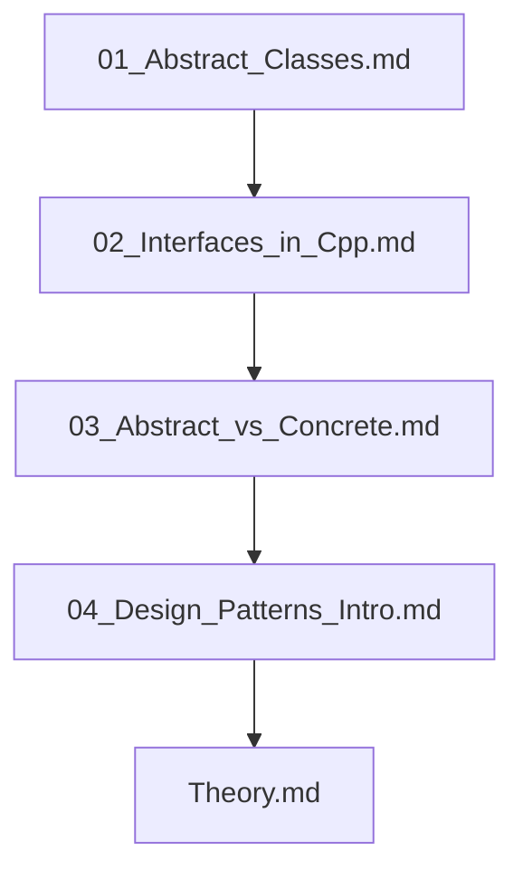

## Folder Map

| Type | Name | Purpose |
| --- | --- | --- |
| File | [01_Abstract_Classes.md](01_Abstract_Classes.md) | understand Abstract Classes |
| File | [02_Interfaces_in_Cpp.md](02_Interfaces_in_Cpp.md) | understand Interfaces in Cpp |
| File | [03_Abstract_vs_Concrete.md](03_Abstract_vs_Concrete.md) | understand Abstract vs Concrete |
| File | [04_Design_Patterns_Intro.md](04_Design_Patterns_Intro.md) | understand Design Patterns Intro |
| File | [Theory.md](Theory.md) | understand Theory |

## Flowchart

# Abstraction

This README is the navigation index for this folder.
## Next Step

- Go to [01_Abstract_Classes.md](01_Abstract_Classes.md) to understand Abstract Classes in C++ - Complete Guide.
