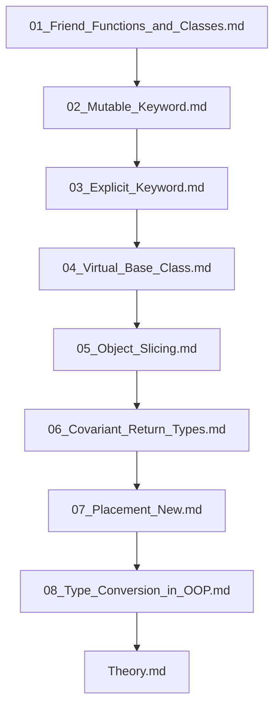

## Folder Map

| Type | Name | Purpose |
| --- | --- | --- |
| File | [01_Friend_Functions_and_Classes.md](01_Friend_Functions_and_Classes.md) | understand Friend Functions and Classes |
| File | [02_Mutable_Keyword.md](02_Mutable_Keyword.md) | understand Mutable Keyword |
| File | [03_Explicit_Keyword.md](03_Explicit_Keyword.md) | understand Explicit Keyword |
| File | [04_Virtual_Base_Class.md](04_Virtual_Base_Class.md) | understand Virtual Base Class |
| File | [05_Object_Slicing.md](05_Object_Slicing.md) | understand Object Slicing |
| File | [06_Covariant_Return_Types.md](06_Covariant_Return_Types.md) | understand Covariant Return Types |
| File | [07_Placement_New.md](07_Placement_New.md) | understand Placement New |
| File | [08_Type_Conversion_in_OOP.md](08_Type_Conversion_in_OOP.md) | understand Type Conversion in OOP |
| File | [Theory.md](Theory.md) | understand Theory |

## Flowchart

# Advanced OOP

This README is the navigation index for this folder.
## Next Step

- Go to [01_Friend_Functions_and_Classes.md](01_Friend_Functions_and_Classes.md) to understand Friend Functions and Classes in C++ - Complete Guide.
