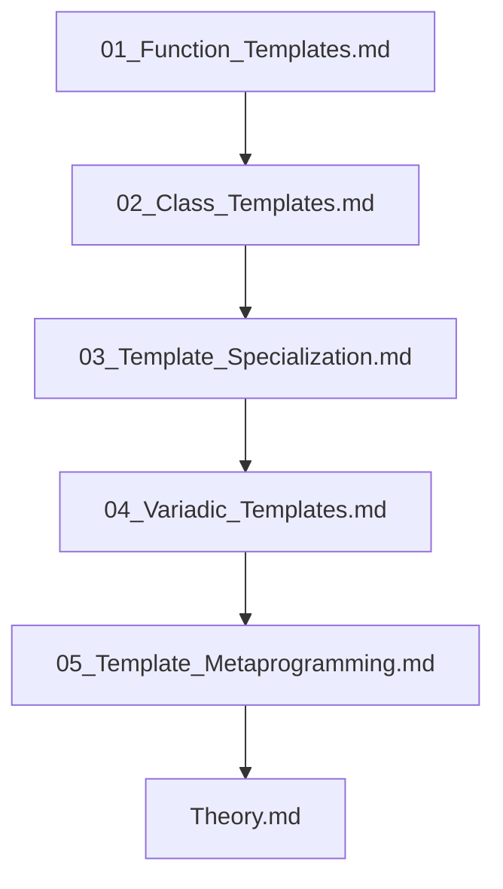

## Folder Map

| Type | Name | Purpose |
| --- | --- | --- |
| File | [01_Function_Templates.md](01_Function_Templates.md) | understand Function Templates |
| File | [02_Class_Templates.md](02_Class_Templates.md) | understand Class Templates |
| File | [03_Template_Specialization.md](03_Template_Specialization.md) | understand Template Specialization |
| File | [04_Variadic_Templates.md](04_Variadic_Templates.md) | understand Variadic Templates |
| File | [05_Template_Metaprogramming.md](05_Template_Metaprogramming.md) | understand Template Metaprogramming |
| File | [Theory.md](Theory.md) | understand Theory |

## Flowchart

# Templates and Generic Programming

This README is the navigation index for this folder.
## Next Step

- Go to [01_Function_Templates.md](01_Function_Templates.md) to understand Function Templates.
