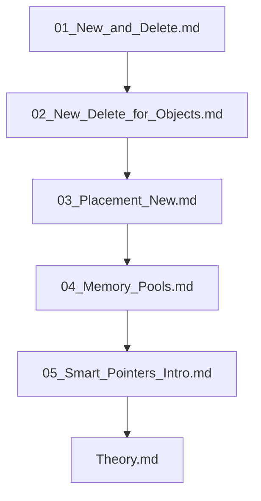

## Folder Map

| Type | Name | Purpose |
| --- | --- | --- |
| File | [01_New_and_Delete.md](01_New_and_Delete.md) | understand New and Delete |
| File | [02_New_Delete_for_Objects.md](02_New_Delete_for_Objects.md) | understand New Delete for Objects |
| File | [03_Placement_New.md](03_Placement_New.md) | understand Placement New |
| File | [04_Memory_Pools.md](04_Memory_Pools.md) | understand Memory Pools |
| File | [05_Smart_Pointers_Intro.md](05_Smart_Pointers_Intro.md) | understand Smart Pointers Intro |
| File | [Theory.md](Theory.md) | understand Theory |

## Flowchart

# Memory Management in OOP

This README is the navigation index for this folder.
## Next Step

- Go to [01_New_and_Delete.md](01_New_and_Delete.md) to understand new and delete Operators in C++ - Complete Guide.
