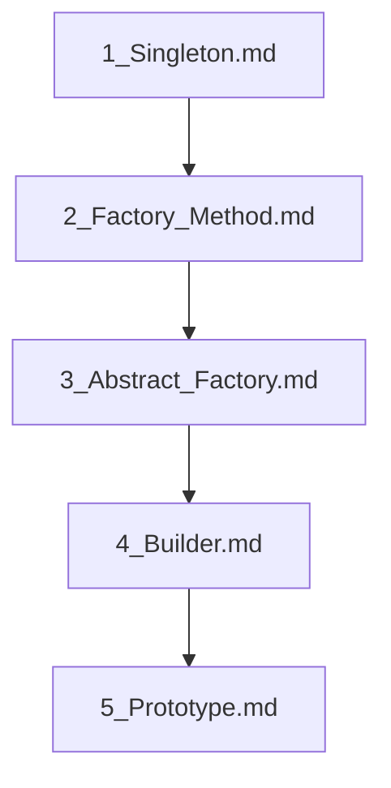

## Folder Map

| Type | Name | Purpose |
| --- | --- | --- |
| File | [1_Singleton.md](1_Singleton.md) | understand Singleton |
| File | [2_Factory_Method.md](2_Factory_Method.md) | understand Factory Method |
| File | [3_Abstract_Factory.md](3_Abstract_Factory.md) | understand Abstract Factory |
| File | [4_Builder.md](4_Builder.md) | understand Builder |
| File | [5_Prototype.md](5_Prototype.md) | understand Prototype |

## Flowchart

# Creational Patterns

This README is the navigation index for this folder.
## Next Step

- Go to [1_Singleton.md](1_Singleton.md) to understand Singleton Pattern in C++ - Complete Guide.
