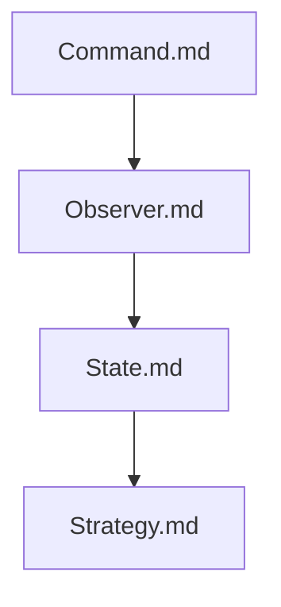

## Folder Map

| Type | Name | Purpose |
| --- | --- | --- |
| File | [Command.md](Command.md) | understand Command |
| File | [Observer.md](Observer.md) | understand Observer |
| File | [State.md](State.md) | understand State |
| File | [Strategy.md](Strategy.md) | understand Strategy |

## Flowchart

# Behavioral Patterns

This README is the navigation index for this folder.
## Next Step

- Go to [Command.md](Command.md) to understand Command Pattern in C++ - Complete Guide.
