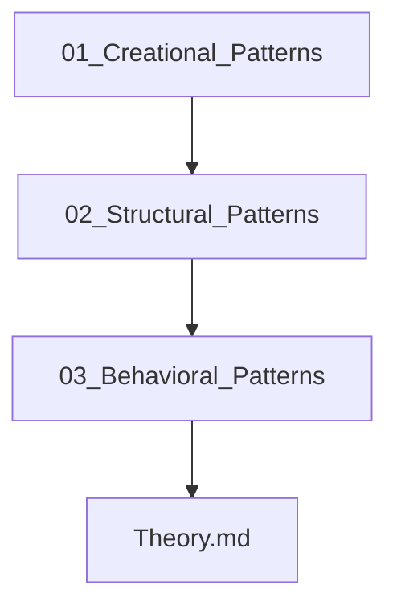

## Folder Map

| Type | Name | Purpose |
| --- | --- | --- |
| Folder | [01_Creational_Patterns](01_Creational_Patterns/README.md) | continue with the Creational Patterns section |
| Folder | [02_Structural_Patterns](02_Structural_Patterns/README.md) | continue with the Structural Patterns section |
| Folder | [03_Behavioral_Patterns](03_Behavioral_Patterns/README.md) | continue with the Behavioral Patterns section |
| File | [Theory.md](Theory.md) | understand Theory |

## Flowchart

# Design Patterns

This README is the navigation index for this folder.
## Next Step

- Go to [Theory.md](Theory.md) to understand Design Patterns in C++ - Complete Guide.
