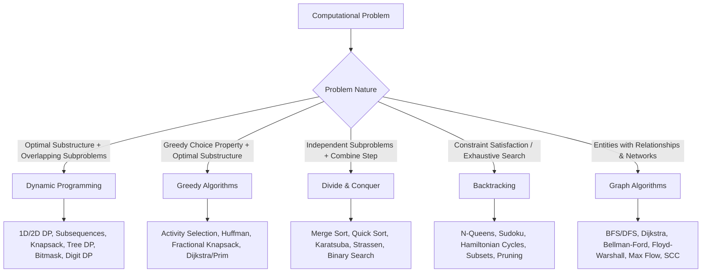

# Algorithms in C++ - Master Curriculum & Architecture Guide

## 1. Overview & Paradigm Architecture

An **algorithm** is a finite, well-defined sequence of computational steps that transforms an input into a desired output. In computer science and competitive software engineering, algorithms are categorized by their underlying **design paradigms**—the fundamental problem-solving philosophies used to establish correctness and achieve optimal time/space complexity.

This directory is a broad C++ algorithms curriculum containing **98 numbered topic modules** plus section indexes and theory overviews. It covers graph algorithms and four major design paradigms: dynamic programming, greedy methods, divide and conquer, and backtracking. The Markdown examples are illustrative; extraction, compilation, and automated verification are in progress.

```
Algorithms/
├── 01. Graph Algorithms/       # Shortest paths, MSTs, network flow, bridges, LCA
├── 02. Dynamic Programming/   # Memoization, tabulation, state compression, digit DP
├── 03. Greedy Algorithms/      # Local optimal choice, scheduling, Huffman, MST
├── 04. Divide and Conquer/     # Partitioning, merge/quick patterns, Master Theorem
└── 05. Backtracking/           # State-space tree exploration, pruning, combinatorial search
```

---

## 2. Core Algorithmic Paradigms



### 1. Divide and Conquer
- **Core Philosophy**: Recursively break down a problem into two or more independent subproblems of the same or related type, solve them recursively, and combine their solutions to solve the original problem.
- **Key Characteristics**: Subproblems do **not** overlap.
- **Canonical Examples**: Merge Sort, Quick Sort, Strassen's Matrix Multiplication, Karatsuba Algorithm, Closest Pair of Points.
- **Mathematical Foundation**: Analyzed using the **Master Theorem** ($T(n) = aT(n/b) + f(n)$) and Akra-Bazzi method.

### 2. Greedy Algorithms
- **Core Philosophy**: Construct a solution incrementally by making the locally optimal choice at each stage with the hope of finding a global optimum.
- **Key Characteristics**: Never reconsiders prior choices (no backtracking). Requires proving the **Greedy-Choice Property** and **Optimal Substructure**.
- **Canonical Examples**: Fractional Knapsack, Huffman Coding, Dijkstra's Shortest Path, Prim's and Kruskal's Minimum Spanning Trees, Job Sequencing.
- **Proof Techniques**: Exchange Arguments, Greedy Stays Ahead, Matroid Theory.

### 3. Dynamic Programming (DP)
- **Core Philosophy**: Solve optimization and counting problems by breaking them into overlapping subproblems, solving each subproblem once, and storing their solutions in a table (memoization or tabulation).
- **Key Characteristics**: Requires **Overlapping Subproblems** and **Optimal Substructure**.
- **Canonical Examples**: 0/1 Knapsack, Longest Common Subsequence (LCS), Longest Increasing Subsequence (LIS), Matrix Chain Multiplication, Digit DP, DP with Bitmasks.
- **Approaches**: Top-down with Memoization ($O(\text{states})$ calls cached) vs. Bottom-up Tabulation (loop-based with memory optimization).

### 4. Backtracking
- **Core Philosophy**: Incrementally build candidates for solutions and abandon a candidate ("backtrack") as soon as it is determined that it cannot possibly be completed to a valid solution.
- **Key Characteristics**: Systematic traversal of a state-space tree; aggressive **pruning** (bounding functions) avoids visiting exponential dead-ends.
- **Canonical Examples**: N-Queens, Sudoku Solver, Rat in a Maze, Subset/Permutation Generation, Hamiltonian Cycle.

### 5. Graph Algorithms
- **Core Philosophy**: Model discrete entities as vertices ($V$) and pairwise relationships as edges ($E$) to solve reachability, connectivity, routing, and flow problems.
- **Key Characteristics**: Can be directed/undirected, cyclic/acyclic, weighted/unweighted.
- **Canonical Examples**: Breadth-First Search (BFS), Depth-First Search (DFS), Dijkstra, Bellman-Ford, Floyd-Warshall, Tarjan's Strongly Connected Components (SCC), Edmonds-Karp / Dinic's Maximum Flow.

---

## 3. Algorithmic Decision Tree

When confronted with an algorithmic problem, utilize this decision framework to identify the target paradigm:

```
                                  [Problem Formulation]
                                            │
               Is the problem modeled on a network / pairwise relations?
                                   ┌────────┴────────┐
                                  YES                NO
                                   │                 │
                         [Graph Algorithms]   Does the problem ask for:
                         • Unweighted: BFS    1. Decision: Is something possible?
                         • Weighted: Dijkstra 2. Optimization: Min/Max cost?
                         • Negative: Bellman  3. Enumeration: Find ALL solutions?
                         • Flow: Dinic/EK     4. Counting: Total ways?
                                                     │
                 ┌───────────────────────────────────┼───────────────────────────────────┐
                 │                                   │                                   │
       [Optimization (Min/Max)]           [Enumeration (Find All)]               [Divide & Conquer]
                 │                                   │                                   │
      Does a local greedy choice              Does N <= 25?                     Are subproblems cleanly
       guarantee global optimum?                     │                          independent without overlap?
          ┌──────┴──────┐                   [Backtracking]                               │
         YES            NO                  • State-Space Search                 [Divide & Conquer]
          │             │                   • Bounding / Pruning                 • Merge / Quick Sort
      [Greedy]   Do subproblems overlap?    • Bitmask recursion                  • Karatsuba / Strassen
      • Interval        │                                                        • Binary Search / D&C
        Scheduling  [Dynamic Programming]
      • Huffman     • 1D/2D Tabulation
      • Fractional  • State Compression
        Knapsack    • Intervals / Trees
```

---

## 4. Master Complexity Comparison Table

| Paradigm | Canonical Algorithm | Best Case Time | Average Case Time | Worst Case Time | Space Complexity |
| :--- | :--- | :--- | :--- | :--- | :--- |
| **Divide & Conquer** | [Merge Sort](04.%20Divide%20and%20Conquer/02_Merge_Sort.md) | $O(N \log N)$ | $O(N \log N)$ | $O(N \log N)$ | $O(N)$ |
| **Divide & Conquer** | [Quick Sort](04.%20Divide%20and%20Conquer/03_Quick_Sort.md) | $O(N \log N)$ | $O(N \log N)$ | $O(N^2)$ | $O(\log N)$ |
| **Divide & Conquer** | [Binary Search](04.%20Divide%20and%20Conquer/04_Binary_Search.md) | $O(1)$ | $O(\log N)$ | $O(\log N)$ | $O(1)$ |
| **Divide & Conquer** | [Karatsuba Multiplication](04.%20Divide%20and%20Conquer/09_Karatsuba_Algorithm.md) | $O(N^{\log_2 3})$ | $O(N^{1.585})$ | $O(N^{1.585})$ | $O(N)$ |
| **Greedy** | [Activity Selection](03.%20Greedy%20Algorithms/02_Activity_Selection.md) | $O(N \log N)$ | $O(N \log N)$ | $O(N \log N)$ | $O(1)$ |
| **Greedy** | [Huffman Coding](03.%20Greedy%20Algorithms/05_Huffman_Coding.md) | $O(N \log N)$ | $O(N \log N)$ | $O(N \log N)$ | $O(N)$ |
| **Greedy** | [Fractional Knapsack](03.%20Greedy%20Algorithms/04_Fractional_Knapsack.md) | $O(N \log N)$ | $O(N \log N)$ | $O(N \log N)$ | $O(1)$ |
| **Dynamic Programming** | [0/1 Knapsack](02.%20Dynamic%20Programming/11_Knapsack_Problems.md) | $O(N \cdot W)$ | $O(N \cdot W)$ | $O(N \cdot W)$ | $O(W)$ |
| **Dynamic Programming** | [Longest Common Subsequence](02.%20Dynamic%20Programming/13_Longest_Common_Subsequence.md) | $O(N \cdot M)$ | $O(N \cdot M)$ | $O(N \cdot M)$ | $O(\min(N, M))$ |
| **Dynamic Programming** | [Longest Increasing Subsequence](02.%20Dynamic%20Programming/14_Longest_Increasing_Subsequence.md) | $O(N \log N)$ | $O(N \log N)$ | $O(N \log N)$ | $O(N)$ |
| **Dynamic Programming** | [Matrix Chain Multiplication](02.%20Dynamic%20Programming/16_Matrix_Chain_Multiplication.md) | $O(N^3)$ | $O(N^3)$ | $O(N^3)$ | $O(N^2)$ |
| **Backtracking** | [N-Queens Solver](05.%20Backtracking/04_N_Queens.md) | $O(N!)$ | $O(N!)$ | $O(N!)$ | $O(N)$ |
| **Backtracking** | [Sudoku Solver](05.%20Backtracking/05_Sudoku_Solver.md) | $O(1)$ | $O(9^m)$ | $O(9^{81})$ | $O(1)$ (bounded) |
| **Graph** | [Dijkstra Algorithm](01.%20Graph%20Algorithms/01_Dijkstra_Algorithm.md) | $O((V + E) \log V)$ | $O((V + E) \log V)$ | $O((V + E) \log V)$ | $O(V)$ |
| **Graph** | [Bellman-Ford Algorithm](01.%20Graph%20Algorithms/02_Bellman_Ford_Algorithm.md) | $O(E)$ | $O(V \cdot E)$ | $O(V \cdot E)$ | $O(V)$ |
| **Graph** | [Floyd-Warshall Algorithm](01.%20Graph%20Algorithms/03_Floyd_Warshall_Algorithm.md) | $O(V^3)$ | $O(V^3)$ | $O(V^3)$ | $O(V^2)$ |
| **Graph** | [Kruskal MST (DSU)](01.%20Graph%20Algorithms/04_Kruskal_Algorithm.md) | $O(E \log E)$ | $O(E \log E)$ | $O(E \log E)$ | $O(V)$ |
| **Graph** | [Tarjan Strongly Connected Comp.](01.%20Graph%20Algorithms/07_SCC.md) | $O(V + E)$ | $O(V + E)$ | $O(V + E)$ | $O(V)$ |
| **Graph** | [Dinic's Maximum Flow](01.%20Graph%20Algorithms/08_Maximum_Flow.md) | $O(V^2 \cdot E)$ | $O(V^2 \cdot E)$ | $O(V^2 \cdot E)$ | $O(V + E)$ |

---

## 5. Curriculum Navigation Map

### [1. Graph Algorithms](01.%20Graph%20Algorithms/README.md) (17 Modules)
Comprehensive graph theory algorithms with adjacency list representations and priority queues:
- **Shortest Paths**: [Dijkstra](01.%20Graph%20Algorithms/01_Dijkstra_Algorithm.md), [Bellman-Ford](01.%20Graph%20Algorithms/02_Bellman_Ford_Algorithm.md), [Floyd-Warshall](01.%20Graph%20Algorithms/03_Floyd_Warshall_Algorithm.md), [Johnson's Algorithm](01.%20Graph%20Algorithms/15_Johnson_Algorithm.md), [A* Heuristic Search](01.%20Graph%20Algorithms/06_A_Star_Algorithm.md).
- **Minimum Spanning Trees**: [Kruskal's Algorithm](01.%20Graph%20Algorithms/04_Kruskal_Algorithm.md), [Prim's Algorithm](01.%20Graph%20Algorithms/05_Prim_Algorithm.md).
- **Network Flow & Cuts**: [Maximum Flow](01.%20Graph%20Algorithms/08_Maximum_Flow.md), [Minimum Cut](01.%20Graph%20Algorithms/09_Minimum_Cut.md), [Bipartite Matching](01.%20Graph%20Algorithms/13_Bipartite_Matching.md).
- **Structural Graph Theory**: [Strongly Connected Components (Tarjan/Kosaraju)](01.%20Graph%20Algorithms/07_SCC.md), [Articulation Points](01.%20Graph%20Algorithms/11_Articulation_Points.md), [Bridges](01.%20Graph%20Algorithms/12_Bridges.md), [Eulerian Path](01.%20Graph%20Algorithms/14_Eulerian_Path.md), [Tarjan's & Binary Lifting LCA](01.%20Graph%20Algorithms/16_Tarjan_LCA.md).

### [2. Dynamic Programming](02.%20Dynamic%20Programming/README.md) (26 Modules)
From fundamental recurrence formulations to advanced contest-level optimizations:
- **Foundations**: [Introduction to DP](02.%20Dynamic%20Programming/01_Introduction_to_DP.md), [Memoization](02.%20Dynamic%20Programming/02_Memoization.md), [Tabulation](02.%20Dynamic%20Programming/03_Tabulation.md), [State Transitions](02.%20Dynamic%20Programming/06_State_Transition.md).
- **Dimensional DP**: [1D DP](02.%20Dynamic%20Programming/04_1D_DP.md), [2D DP](02.%20Dynamic%20Programming/05_2D_DP.md), [DP on Grids](02.%20Dynamic%20Programming/10_DP_on_Grids.md).
- **Classic DP Problems**: [Knapsack Problems](02.%20Dynamic%20Programming/11_Knapsack_Problems.md), [Unbounded Knapsack](02.%20Dynamic%20Programming/12_Unbounded_Knapsack.md), [LCS](02.%20Dynamic%20Programming/13_Longest_Common_Subsequence.md), [LIS](02.%20Dynamic%20Programming/14_Longest_Increasing_Subsequence.md), [Edit Distance](02.%20Dynamic%20Programming/15_Edit_Distance.md), [Matrix Chain Multiplication](02.%20Dynamic%20Programming/16_Matrix_Chain_Multiplication.md).
- **Advanced DP**: [DP with Bitmasks](02.%20Dynamic%20Programming/17_DP_with_Bitmasks.md), [Digit DP](02.%20Dynamic%20Programming/18_Digit_DP.md), [DP with State Compression](02.%20Dynamic%20Programming/19_DP_with_State_Compression.md), [DP on Intervals](02.%20Dynamic%20Programming/20_DP_on_Intervals.md), [Probability DP](02.%20Dynamic%20Programming/22_Probability_DP.md), [DP on DAGs](02.%20Dynamic%20Programming/23_DP_on_DAGs.md), [Optimization Techniques](02.%20Dynamic%20Programming/24_Optimization_Techniques.md).

### [3. Greedy Algorithms](03.%20Greedy%20Algorithms/README.md) (23 Modules)
Rigorous greedy methods with exchange proofs:
- **Scheduling & Intervals**: [Activity Selection](03.%20Greedy%20Algorithms/02_Activity_Selection.md), [Job Sequencing](03.%20Greedy%20Algorithms/03_Job_Sequencing.md), [Minimum Platforms](03.%20Greedy%20Algorithms/07_Minimum_Number_of_Platforms.md), [Interval Scheduling](03.%20Greedy%20Algorithms/08_Interval_Scheduling.md), [Interval Partitioning](03.%20Greedy%20Algorithms/09_Interval_Partitioning.md).
- **Coding & Packing**: [Fractional Knapsack](03.%20Greedy%20Algorithms/04_Fractional_Knapsack.md), [Huffman Coding](03.%20Greedy%20Algorithms/05_Huffman_Coding.md), [Minimum Cost to Connect Sticks](03.%20Greedy%20Algorithms/13_Minimum_Cost_to_Connect_Sticks.md), [Assign Cookies](03.%20Greedy%20Algorithms/19_Assign_Cookies.md).
- **Greedy Sequences**: [Gas Station Circuit](03.%20Greedy%20Algorithms/14_Gas_Station_Problem.md), [Candy Distribution](03.%20Greedy%20Algorithms/17_Candy_Distribution.md), [Jump Game](03.%20Greedy%20Algorithms/18_Jump_Game.md), [Proof of Optimality](03.%20Greedy%20Algorithms/21_Proof_of_Optimality.md).

### [4. Divide and Conquer](04.%20Divide%20and%20Conquer/README.md) (19 Modules)
Recursive decomposition and subproblem recombination:
- **Sorting & Searching**: [Merge Sort](04.%20Divide%20and%20Conquer/02_Merge_Sort.md), [Quick Sort](04.%20Divide%20and%20Conquer/03_Quick_Sort.md), [Binary Search](04.%20Divide%20and%20Conquer/04_Binary_Search.md), [Quick Select](04.%20Divide%20and%20Conquer/13_Quick_Select.md), [Median of Two Sorted Arrays](04.%20Divide%20and%20Conquer/10_Median_of_Two_Sorted_Arrays.md).
- **Arithmetic & Geometry**: [Karatsuba Multiplication](04.%20Divide%20and%20Conquer/09_Karatsuba_Algorithm.md), [Strassen's Matrix Multiplication](04.%20Divide%20and%20Conquer/06_Strassens_Matrix_Multiplication.md), [Closest Pair of Points](04.%20Divide%20and%20Conquer/07_Closest_Pair_of_Points.md), [Convex Hull](04.%20Divide%20and%20Conquer/14_Convex_Hull.md), [Power Exponentiation](04.%20Divide%20and%20Conquer/05_Power_Exponentiation.md).
- **Theory & Recurrences**: [Master Theorem](04.%20Divide%20and%20Conquer/15_Master_Theorem.md), [Recurrence Relations](04.%20Divide%20and%20Conquer/16_Recurrence_Relations.md), [When to Use D&C](04.%20Divide%20and%20Conquer/17_When_to_Use_Divide_and_Conquer.md).

### [5. Backtracking](05.%20Backtracking/README.md) (22 Modules)
Combinatorial search, state-space tree traversal, and branch-and-bound pruning:
- **Puzzles & Board Games**: [N-Queens](05.%20Backtracking/04_N_Queens.md), [Sudoku Solver](05.%20Backtracking/05_Sudoku_Solver.md), [Knight's Tour](05.%20Backtracking/07_Knight_Tour.md), [Rat in a Maze](05.%20Backtracking/06_Rat_in_a_Maze.md), [Word Search](05.%20Backtracking/12_Word_Search.md), [Crossword Puzzle](05.%20Backtracking/18_Crossword_Puzzle.md).
- **Combinatorics**: [Generate Parentheses](05.%20Backtracking/08_Generate_Parentheses.md), [Subset Generation](05.%20Backtracking/09_Subset_Generation.md), [Permutation Generation](05.%20Backtracking/10_Permutation_Generation.md), [Combination Sum](05.%20Backtracking/13_Combination_Sum.md), [Palindrome Partitioning](05.%20Backtracking/14_Palindrome_Partitioning.md).
- **Graph Backtracking**: [M-Coloring Problem](05.%20Backtracking/15_M_coloring_Problem.md), [Hamiltonian Cycle](05.%20Backtracking/16_Hamiltonian_Cycle.md), [Tug of War](05.%20Backtracking/17_Tug_of_War.md).
- **Theory & Pruning**: [Pruning Techniques](05.%20Backtracking/03_Pruning_Techniques.md), [Backtracking vs Brute Force](05.%20Backtracking/19_Backtracking_vs_Brute_Force.md), [Backtracking vs DP](05.%20Backtracking/20_Backtracking_vs_DP.md).

---

## 6. How to Use This Repository

1. **Study Theory First**: Each subfolder contains a dedicated `Theory.md` covering invariants, proofs, and recurrence definitions.
2. **Review Implementations Critically**: Examples emphasize readable algorithm structure, but may be fragments or await technical verification. Check the lesson's required language standard and test extracted code before reuse.
3. **Trace Step-by-Step Executions**: ASCII memory layouts and call-stack visualizations accompany non-trivial recursions and pointer updates.
4. **Compile & Experiment**: Markdown files are not compiler inputs. Copy or extract a complete code block into `main.cpp`, then compile it using the lesson's declared minimum standard. For C++17 examples, a typical command is:
   ```bash
   g++ -std=c++17 -Wall -Wextra -O2 main.cpp -o main
   ./main
   ```
