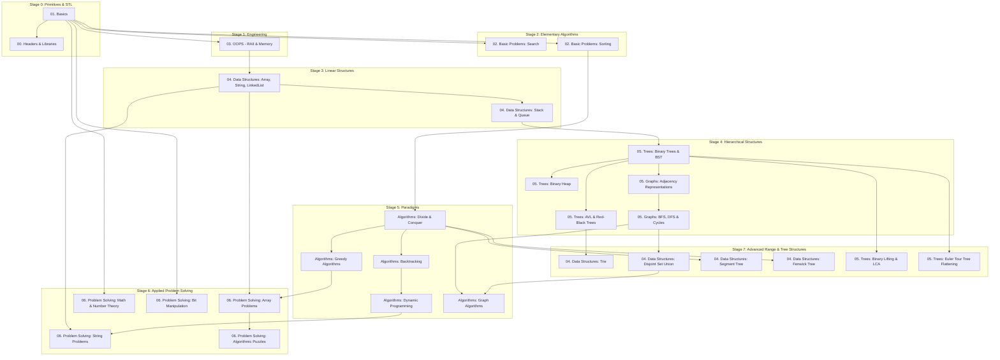

# C++ Data Structures & Algorithms: Master Knowledge Architecture & Curriculum Map

> **Curriculum Status**: Broad study map; implementation verification is in progress.
>
> **Language Tracks**: C++17 core, with C++20 and C++23 material labeled where those standards are required.
>
> **Repository Root**: `d:\DSA\1. C++`
>
> **Audit and Roadmap**: See [REPORT.md](REPORT.md).

---

## 1. Pedagogical Architecture & Philosophy

This repository is organized as an implementation-focused curriculum for Data Structures and Algorithms in C++. The following are target quality criteria; individual lessons may still be awaiting review, compilation, or testing:
1. **Mathematical Formalism & Invariants**: Clear inductive definitions, recurrence relations, and loop/state invariants.
2. **Memory & Pointer Visualizations**: Detailed ASCII architectural diagrams depicting memory layouts, stack frames, heap pointers, and cache-line interactions.
3. **Canonical C++ Implementations**: Extracted, compilable, and tested examples with an explicit minimum language standard.
4. **Asymptotic Complexity Proofs**: Reviewed Big-$O$, $\Omega$, and $\Theta$ derivations for both time and auxiliary space.
5. **Practical Depth**: Concise explanations, relevant edge cases, and interview/competitive-programming patterns appropriate to the lesson.

```
       ┌────────────────────────────────────────────────────────┐
       │   LEVEL 0: Language Primitives & Memory Foundations    │
       │   (01. Basics  •  00. Headers and Libraries)          │
       └───────────────────────────┬────────────────────────────┘
                                   │
                                   ▼
       ┌────────────────────────────────────────────────────────┐
       │   LEVEL 1: Object-Oriented Engineering & Modern C++    │
       │   (03. OOPS: RAII, Rule of 5, Templates, Virtual Vptr) │
       └───────────────────────────┬────────────────────────────┘
                                   │
                                   ▼
       ┌────────────────────────────────────────────────────────┐
       │   LEVEL 2: Search, Sorting & Complexity Foundations    │
       │   (02. Basic Problems: Divide & Conquer, Quick/Merge)  │
       └───────────────────────────┬────────────────────────────┘
                                   │
                                   ▼
       ┌────────────────────────────────────────────────────────┐
       │   LEVEL 3: Linear & Associative Data Structures        │
       │   (04. Data Structures: Vector, List, Stack, Map, Set) │
       └───────────────────────────┬────────────────────────────┘
                                   │
                                   ▼
       ┌────────────────────────────────────────────────────────┐
       │   LEVEL 4: Hierarchical & Non-Linear Structures        │
       │   (05. Trees and Graphs: BST, AVL, RB-Tree, Heaps)     │
       └───────────────────────────┬────────────────────────────┘
                                   │
                                   ▼
       ┌────────────────────────────────────────────────────────┐
       │   LEVEL 5: Algorithmic Paradigms & Optimization        │
       │   (Algorithms: Greedy, Dynamic Programming, Backtrack) │
       └───────────────────────────┬────────────────────────────┘
                                   │
                                   ▼
       ┌────────────────────────────────────────────────────────┐
       │   LEVEL 6: Applied Problem Solving & Archetypes        │
       │   (06. Problem Solving: Strings, Arrays, Puzzles, Bits)│
       └───────────────────────────┬────────────────────────────┘
                                   │
                                   ▼
       ┌────────────────────────────────────────────────────────┐
       │   LEVEL 7: Advanced Range Query & Tree Decomposition   │
       │   (Segment Tree, Fenwick, DSU, Binary Lifting, Euler)  │
       └────────────────────────────────────────────────────────┘
```

---

## 2. Prerequisite Dependency Graph

The following Mermaid diagram maps the prerequisite learning flow across all 8 modules of the repository:



---

## 3. Detailed Curriculum Taxonomy & File-Folder Relationships

### Level 0: Foundations & Language Primitives

#### `01. Basics/` — Primitives, Scopes & Memory Safety
Fundamental building blocks of memory, flow control, and memory manipulation.
- [Variables, Keywords, Operators](01.%20Basics/01_Variables_Keywords_and_Operators.md): Primitive storage, IEEE 754 floating point, bitwise arithmetic, type coercion.
- [Conditional Statements](01.%20Basics/02_Conditional_Statements.md): Branch prediction, jump tables in switch statements, ternary expressions.
- [Loops & Iteration](01.%20Basics/03_Loops_and_Iteration.md): Unrolling, loop invariants, iterator vs index stepping.
- [Functions & Scope](01.%20Basics/04_Functions_and_Scope.md): Stack call frames, name mangling, pass-by-value vs reference, inline expansion.
- [Arrays & Strings](01.%20Basics/05_Arrays_and_Strings.md): Contiguous memory bounds, pointer decay, null termination, buffer safety.
- [Pointers & Memory Management](01.%20Basics/06_Pointers_and_Memory_Management.md): Heap (`malloc`/`free`, `new`/`delete`), pointer arithmetic, memory leaks.
- [Error Handling](01.%20Basics/07_Error_Handling.md): Stack unwinding, exception safety guarantees, assertion invariants.

#### `00. Headers and Libraries/` — The Standard Template Library (STL)
Mastery of the standard C++ library headers with internals and implementation mechanics.
- **Fundamentals**:
  - Sequence Containers: [`<vector>`](00.%20Headers%20and%20Libraries/Fundamentals/02_vector.md), [`<deque>`](00.%20Headers%20and%20Libraries/Fundamentals/12_deque.md), [`<list>`](00.%20Headers%20and%20Libraries/Fundamentals/13_list.md), [`<forward_list>`](00.%20Headers%20and%20Libraries/Fundamentals/14_forward_list.md), [`<array>`](00.%20Headers%20and%20Libraries/Fundamentals/11_array/README.md).
  - Associative & Hash Containers: [`<set>`](00.%20Headers%20and%20Libraries/Fundamentals/15_set.md), [`<map>`](00.%20Headers%20and%20Libraries/Fundamentals/17_map/README.md), [`<unordered_set>`](00.%20Headers%20and%20Libraries/Fundamentals/16_unordered_set.md), [`<unordered_map>`](00.%20Headers%20and%20Libraries/Fundamentals/18_unordered_map.md).
  - Adapters: [`<stack>`](00.%20Headers%20and%20Libraries/Fundamentals/19_stack.md), [`<queue>`](00.%20Headers%20and%20Libraries/Fundamentals/20_queue.md), [`<priority_queue>`](00.%20Headers%20and%20Libraries/Fundamentals/21_priority_queue.md).
  - Utilities & Algorithms: [`<algorithm>`](00.%20Headers%20and%20Libraries/Fundamentals/04_algorithm.md), [`<numeric>`](00.%20Headers%20and%20Libraries/Fundamentals/24_numeric.md), [`<memory>`](00.%20Headers%20and%20Libraries/Fundamentals/22_memory.md), [`<utility>`](00.%20Headers%20and%20Libraries/Fundamentals/09_utility.md), [`<functional>`](00.%20Headers%20and%20Libraries/Fundamentals/25_functional.md), [`<tuple>`](00.%20Headers%20and%20Libraries/Fundamentals/10_tuple.md).
- **Others**:
  - Concurrency & Modern C++: [`smart_pointers.md`](00.%20Headers%20and%20Libraries/Others/smart_pointers.md), [`move_semantics.md`](00.%20Headers%20and%20Libraries/Others/move_semantics.md), [`concurrency.md`](00.%20Headers%20and%20Libraries/Others/concurrency.md), [`design_patterns.md`](00.%20Headers%20and%20Libraries/Others/design_patterns.md).

---

### Level 1: Object-Oriented Engineering & Memory Lifecycles

#### `03. OOPS/` — Industrial C++ Object Architecture
Deep object-oriented design and memory safety models.
- [01. Introduction](03.%20OOPS/01_Introduction/): Procedural vs OOP paradigms, state encapsulation.
- [02. Classes and Objects](03.%20OOPS/02_Classes_and_Objects/): Memory layout, data member alignment, static methods, const member functions.
- [03. Constructors and Destructors](03.%20OOPS/03_Constructors_and_Destructors/): Initialization lists, copy constructors, move constructors, **Rule of Three / Five / Zero** ([10_Rule_of_Three_Five_Zero.md](03.%20OOPS/03_Constructors_and_Destructors/10_Rule_of_Three_Five_Zero.md)).
- [04. Encapsulation](03.%20OOPS/04_Encapsulation/): Invariant maintenance, access control boundaries.
- [05. Inheritance](03.%20OOPS/05_Inheritance/): Object slicing, virtual inheritance, solving the Diamond Problem ([05_Diamond_Problem.md](03.%20OOPS/05_Inheritance/05_Diamond_Problem.md)).
- [06. Polymorphism](03.%20OOPS/06_Polymorphism/): Compile-time operator overloading vs runtime dynamic dispatch via `vptr` and `vtable` ([06_Virtual_Table.md](03.%20OOPS/06_Polymorphism/02_Run_Time_Polymorphism/06_Virtual_Table.md)).
- [07. Abstraction](03.%20OOPS/07_Abstraction/): Pure virtual interfaces, contract-driven architecture.
- [08. Advanced OOP](03.%20OOPS/08_Advanced_OOP/): Placement new, friend constructs, explicit conversions.
- [09. Templates & Metaprogramming](03.%20OOPS/09_Templates_and_Generic_Programming/): Variadic templates, compile-time specialization, SFINAE.
- [10. Exception Handling & RAII](03.%20OOPS/10_Exception_Handling_in_OOP/): RAII resource guards, stack unwinding safety guarantees.
- [11. Memory Management](03.%20OOPS/11_Memory_Management_in_OOP/): Custom allocators, object pools.
- [12. Design Patterns](03.%20OOPS/12_Design_Patterns/): Gang of Four patterns in modern C++ (Creational, Structural, Behavioral).

---

### Level 2: Elementary Algorithms & Search/Sort

#### `02. Basic Problems/` — Algorithmic Foundations
- **Search Algorithms** ([Search/README.md](02.%20Basic%20Problems/Search/README.md)):
  - Classical: Linear Search ($O(N)$), Binary Search ($O(\log N)$).
  - Specialized: Jump Search ($O(\sqrt{N})$), Interpolation Search ($O(\log \log N)$ avg), Exponential Search ($O(\log N)$), Fibonacci Search ($O(\log N)$), Ternary Search ($O(\log_3 N)$ unimodal optimization).
- **Sorting Algorithms** ([Sorting/README.md](02.%20Basic%20Problems/Sorting/README.md)):
  - $O(N^2)$ Comparison: Bubble, Insertion, Selection, Cocktail, Gnome, Odd-Even.
  - $O(N \log N)$ Divide & Conquer: Merge Sort, Quick Sort (Lomuto & Hoare), Heap Sort, Intro Sort (Hybrid `std::sort`), Tim Sort (Run-based adaptive).
  - Non-Comparison Linear Sorts: Counting Sort ($O(N + K)$), Radix Sort ($O(d \cdot (N + K))$), Bucket Sort ($O(N)$ avg).
  - Invariant Sorts: Cycle Sort (Optimal minimum writes), Shell Sort (Diminishing increments), Bitonic Sort (Parallel sorting networks).

---

### Level 3: Linear & Associative Data Structures

#### `04. Data Structures/` — Abstract Data Types & Custom Implementations
Standard-container API references have one canonical home in `00. Headers and Libraries`; this section focuses on representations and invariants:
- [Data-Structure Foundations](04.%20Data%20Structures/Theory.md): ADTs, representation invariants, cost models, ownership, and testing.
- [Standard-Library References](00.%20Headers%20and%20Libraries/Fundamentals/README.md): Canonical pages for arrays, strings, sequence containers, adapters, maps, sets, and vocabulary types.
- [09_Linked_List.md](04.%20Data%20Structures/09_Linked_List.md): Singly linked, doubly linked, circular lists, Floyd's cycle detection.
- [10_Custom_Stack_and_Queue.md](04.%20Data%20Structures/10_Custom_Stack_and_Queue.md): Circular ring-buffer queue, 2-stack queue, Min-Stack in $O(1)$.
- [11_Trie.md](04.%20Data%20Structures/11_Trie.md): Prefix search and binary tries.
- [12_Disjoint_Set_Union.md](04.%20Data%20Structures/12_Disjoint_Set_Union.md): Dynamic connectivity with path compression and union by rank/size.
- [14_Fenwick_Tree.md](04.%20Data%20Structures/14_Fenwick_Tree.md): Compact prefix aggregation and point updates.
- [13_Segment_Tree.md](04.%20Data%20Structures/13_Segment_Tree.md): General range aggregation and lazy updates.

---

### Level 4: Hierarchical & Non-Linear Structures

#### `05. Trees and Graphs/` — Trees, Self-Balancing Trees & Graphs
- [01_Binary_Trees](05.%20Trees%20and%20Graphs/01_Binary_Trees/): Tree properties, recursive vs iterative traversals, height, diameter, maximum path sum.
- [02_BST](05.%20Trees%20and%20Graphs/02_BST/): Search, insert, delete (3-case node deletion with inorder successor), validation.
- [03_AVL_Trees](05.%20Trees%20and%20Graphs/03_AVL_Trees/): Strict balance factor $BF \in \{-1, 0, 1\}$, Left/Right/Left-Right/Right-Left single and double rotations.
- [07_Red_Black_Trees](05.%20Trees%20and%20Graphs/07_Red_Black_Trees/01_Red_Black_Tree.md): 5 Red-Black properties, recoloring, structural rotations, $O(\log N)$ guarantee.
- [08_Binary_Heap](05.%20Trees%20and%20Graphs/08_Binary_Heap/01_Binary_Heap.md): Array-based implicit binary tree, 1-indexed / 0-indexed formulas, `siftUp`, `siftDown`, linear time `buildHeap` in $O(N)$.
- [04_Graph_Representations](05.%20Trees%20and%20Graphs/04_Graph_Representations/): Adjacency Matrix ($O(V^2)$), Adjacency List ($O(V+E)$), Edge List ($O(E)$), trade-offs.
- [05_Tree_Traversals](05.%20Trees%20and%20Graphs/05_Tree_Traversals/): Preorder, Inorder, Postorder, Level-Order (BFS), Morris Inorder Traversal in $O(1)$ space.
- [06_Basic_Graph_Algorithms](05.%20Trees%20and%20Graphs/06_Basic_Graph_Algorithms/): BFS shortest path on unweighted graphs, DFS connectivity, Cycle detection (3-color DFS), Kahn's algorithm & DFS Topological Sort.

---

### Level 5: Algorithmic Paradigms & Optimization

#### `Algorithms/` — Advanced Design Paradigms
- **01. Divide and Conquer** ([Divide and Conquer/README.md](Algorithms/04.%20Divide%20and%20Conquer/README.md)):
  - Master Theorem: $T(N) = aT(N/b) + f(N)$, 3 cases.
  - Algorithms: Merge Sort, Quick Sort, Binary Search, Closest Pair of Points ($O(N \log N)$), Karatsuba Fast Multiplication ($O(N^{\log_2 3}) \approx O(N^{1.585})$), Strassen Matrix Multiplication ($O(N^{\log_2 7}) \approx O(N^{2.807})$), Convex Hull (Divide and Conquer).
- **02. Backtracking** ([Backtracking/README.md](Algorithms/05.%20Backtracking/README.md)):
  - Pruning state-space trees: N-Queens, Sudoku Solver (exact cover logic), Rat in a Maze, Knight's Tour (Warnsdorff's heuristic), Subset Sum, Palindrome Partitioning, M-Coloring, Hamiltonian Cycle.
- **03. Greedy Algorithms** ([Greedy Algorithms/README.md](Algorithms/03.%20Greedy%20Algorithms/README.md)):
  - Foundations: Greedy Choice Property & Optimal Substructure.
  - Classical Problems: Activity Selection, Job Sequencing with Deadlines, Fractional Knapsack, Huffman Coding, Minimum Platforms, Interval Scheduling.
  - Canonical Replacements (Zero Fluff):
    - [10_Egyptian_Fraction.md](Algorithms/03.%20Greedy%20Algorithms/10_Egyptian_Fraction.md): Fibonacci-Sylvester greedy expansion with termination proof.
    - [11_Police_and_Thieves.md](Algorithms/03.%20Greedy%20Algorithms/11_Police_and_Thieves.md): Greedy two-pointer matching under bounded distance $K$, exchange argument proof.
    - [12_Optimal_Merge_Patterns.md](Algorithms/03.%20Greedy%20Algorithms/12_Optimal_Merge_Patterns.md): Huffman merge tree minimization using min-heaps in $O(N \log N)$.
- **04. Dynamic Programming** ([Dynamic Programming/README.md](Algorithms/02.%20Dynamic%20Programming/README.md)):
  - Paradigms: Top-down Memoization vs Bottom-up Tabulation, Space Compression.
  - Problem Classes: 1D DP, 2D Grid DP, Knapsack (0/1, Unbounded, Fractional), LCS, LIS ($O(N \log N)$ patience sorting), Matrix Chain Multiplication (MCM), DP on Intervals, Bitmask DP (TSP in $O(N^2 2^N)$), Digit DP, DP on Trees, DP on DAGs.
- **05. Graph Algorithms** ([Graph Algorithms/README.md](Algorithms/01.%20Graph%20Algorithms/README.md)):
  - Shortest Paths: Dijkstra ($O((V+E)\log V)$), Bellman-Ford ($O(VE)$), Floyd-Warshall ($O(V^3)$), Johnson's All-Pairs ($O(V^2 \log V + VE)$).
  - Minimum Spanning Trees: Kruskal (DSU-based $O(E \log E)$), Prim (Priority queue $O(E \log V)$).
  - Connectivity & Flows: Kosaraju / Tarjan Strongly Connected Components, Ford-Fulkerson & Edmonds-Karp Max Flow ($O(V E^2)$), Min-Cut Max-Flow Theorem, Hopcroft-Karp Bipartite Matching ($O(E \sqrt{V})$), Articulation Points & Bridges (Tarjan's low-link values), Eulerian Path (Hierholzer's algorithm $O(V+E)$).

---

### Level 6: Applied Problem Solving & Archetypes

#### `06. Problem Solving/` — Production & Interview Problem Solving
- **01. Mathematical Problems** ([Mathematical Problems/README.md](06.%20Problem%20Solving/01_Mathematical_Problems/README.md)):
  - Sieve of Eratosthenes ($O(N \log \log N)$), Segmented Sieve, Prime Factorization, Extended Euclidean Algorithm, Modular Inverse, Fermat's Little Theorem, Chinese Remainder Theorem.
- **02. Bit Manipulation** ([Bit Manipulation/README.md](06.%20Problem%20Solving/02_Bit_Manipulation/README.md)):
  - Kernighan's bit-count ($n \ \& \ (n-1)$), power of 2 check, single number isolation with XOR, subset mask generation ($sub = (sub - 1) \ \& \ mask$), bitwise manipulation of indices.
- **03. String Problems** ([String Problems/README.md](06.%20Problem%20Solving/03_String_Problems/README.md)):
  - [01_String_Basics.md](06.%20Problem%20Solving/03_String_Problems/01_String_Basics.md): SSO union internals, zero-copy `StringView`, custom `DynamicString` with Rule of 5.
  - [02_String_Algorithms.md](06.%20Problem%20Solving/03_String_Problems/02_String_Algorithms.md): KMP ($O(N+M)$ $\pi$-table), Rabin-Karp polynomial rolling hash.
  - [03_Pattern_Matching.md](06.%20Problem%20Solving/03_String_Problems/03_Pattern_Matching.md): Z-Algorithm ($O(N+M)$ $Z$-box), Boyer-Moore bad-character rule.
  - [04_String_Transformation.md](06.%20Problem%20Solving/03_String_Problems/04_String_Transformation.md): In-place word reversal in $O(1)$ space, in-place Run-Length Encoding, Palindrome Insertions DP.
  - [05_Advanced_String_Problems.md](06.%20Problem%20Solving/03_String_Problems/05_Advanced_String_Problems.md): Aho-Corasick automaton, Manacher's Algorithm ($O(N)$ palindromes).
- **04. Array Problems** ([Array Problems/README.md](06.%20Problem%20Solving/04_Array_Problems/README.md)):
  - [01_Array_Basics.md](06.%20Problem%20Solving/04_Array_Problems/01_Array_Basics.md): Cache lines, row vs col major stride, contiguous memory layout.
  - [02_Two_Pointer_Technique.md](06.%20Problem%20Solving/04_Array_Problems/02_Two_Pointer_Technique.md): Converging pointers (3-Sum, Trapping Rain Water in $O(1)$ space), Dutch National Flag (3-way partition).
  - [03_Sliding_Window.md](06.%20Problem%20Solving/04_Array_Problems/03_Sliding_Window.md): Fixed vs dynamic windows, Monotonic Deque Sliding Window Maximum in $O(N)$, Minimum Window Substring.
  - [04_Array_Rotation.md](06.%20Problem%20Solving/04_Array_Problems/04_Array_Rotation.md): 3-reversal algorithm, Juggling algorithm (GCD cycle decomposition), Block swap.
  - [05_Subarray_Problems.md](06.%20Problem%20Solving/04_Array_Problems/05_Subarray_Problems.md): Kadane's maximum subarray sum ($O(N)$ time, $O(1)$ space), Prefix Sum + Hash Map for target sum.
  - [06_Next_Permutation.md](06.%20Problem%20Solving/04_Array_Problems/06_Next_Permutation.md): Narayana Pandita's lexicographical algorithm in $O(N)$ time and $O(1)$ space.
  - [07_Merge_Intervals.md](06.%20Problem%20Solving/04_Array_Problems/07_Merge_Intervals.md): In-place interval merging via start-coordinate sort.
  - [08_Container_With_Most_Water.md](06.%20Problem%20Solving/04_Array_Problems/08_Container_With_Most_Water.md): Strict greedy boundary elimination proof.
  - [09_Product_Except_Self.md](06.%20Problem%20Solving/04_Array_Problems/09_Product_Except_Self.md): Division-free prefix and suffix product passes in $O(1)$ auxiliary space.
  - [10_Find_Duplicate_Number.md](06.%20Problem%20Solving/04_Array_Problems/10_Find_Duplicate_Number.md): Floyd's Tortoise and Hare cycle detection on array pointers.
- **05. Puzzle Problems** ([Puzzle Problems/README.md](06.%20Problem%20Solving/05_Puzzle_Problems/README.md)):
  - Algorithmic deduction, Conway's Game of Life, fractal generators, invariant boundary puzzles, Nim game / Sprague-Grundy theorem.

---

### Level 7: Advanced Range Query & Tree Decomposition

#### Range Structures & Tree Decomposition
Specialized high-performance data structures for range aggregate queries and dynamic connectivity:
- [11_Trie.md](04.%20Data%20Structures/11_Trie.md): Standard Trie for prefix matching and `BinaryTrie` for bitwise Maximum XOR queries.
- [12_Disjoint_Set_Union.md](04.%20Data%20Structures/12_Disjoint_Set_Union.md): DSU with Path Compression and Union by Rank/Size achieving inverse Ackermann $O(\alpha(N))$ amortized time.
- [13_Segment_Tree.md](04.%20Data%20Structures/13_Segment_Tree.md): Array-based segment tree for range queries in $O(\log N)$ and Lazy Propagation for range updates.
- [14_Fenwick_Tree.md](04.%20Data%20Structures/14_Fenwick_Tree.md): Binary Indexed Tree using lowest set bit `i & (-i)`, supporting point update / range query, range update / point query, and 2D Fenwick trees.
- [01_Binary_Lifting_and_LCA.md](05.%20Trees%20and%20Graphs/09_Advanced_Tree_Techniques/01_Binary_Lifting_and_LCA.md): $2^k$-ancestor jump table `up[node][k]`, computing LCA and $K$-th ancestor in $O(\log N)$ time with $O(N \log N)$ preprocessing.
- [02_Euler_Tour_Tree_Flattening.md](05.%20Trees%20and%20Graphs/09_Advanced_Tree_Techniques/02_Euler_Tour_Tree_Flattening.md): Tree DFS entry/exit timestamps `tin[u]` and `tout[u]`, flattening subtrees into contiguous array intervals `[tin[u], tout[u]]` for Segment Tree integration.

---

## 4. Master Algorithmic Complexity Cheat Sheet

| Data Structure / Algorithm | Operation / Case | Time Complexity | Structure Storage / Operation Space | Key Invariant / Trait |
|:---|:---|:---:|:---:|:---|
| **Static Array** | Access | $O(1)$ | $O(N)$ storage / $O(1)$ operation space | Fixed-size contiguous storage; no general append operation |
| **Dynamic Array (`vector`)** | Push Back | Amortized $O(1)$; $O(N)$ when reallocation occurs | $O(N)$ storage; reallocation may temporarily require $O(N)$ additional storage | Geometric growth is typical, but the exact factor is implementation-specific |
| **Singly / Doubly Linked List** | Insert at Head / Search | $O(1)$ / $O(N)$ | $O(N)$ storage / $O(1)$ iterative operation space | Dynamic nodes and pointer traversal |
| **Stack / Queue** | Push / Pop / Top or Front | Usually $O(1)$ for standard adapters | $O(N)$ storage / usually $O(1)$ operation space | LIFO / FIFO ordering |
| **Binary Heap / Priority Queue** | Insert / Extract-Min | $O(\log N)$ | $O(N)$ storage / $O(1)$ iterative operation space | Complete binary tree shape and heap order |
| **Binary Search Tree (Unbalanced)** | Search / Insert / Delete | $O(N)$ worst, $O(\log N)$ avg | $O(H)$ recursion | BST invariant: $Left < Root < Right$ |
| **AVL Tree** | Search / Insert / Delete | $O(\log N)$ worst case | $O(N)$ storage / up to $O(\log N)$ recursive stack | Balance factor $BF \in \{-1, 0, 1\}$ |
| **Ordered associative container (`std::map`)** | Search / Insert / Delete | $O(\log N)$ | $O(N)$ storage | Commonly a red-black tree, but the standard does not mandate that representation |
| **Trie (Prefix Tree)** | Insert / Search (word length $L$) | $O(L)$ | Depends on total stored characters and dense vs sparse child representation | Shared common prefixes |
| **Disjoint Set Union (DSU)** | Find / Union | $O(\alpha(N))$ amortized | $O(N)$ storage | Path compression + union by rank/size |
| **Segment Tree (with Lazy)** | Range Query / Update | $O(\log N)$ | $O(N)$ storage / $O(\log N)$ recursive stack | Hierarchical interval decomposition |
| **Fenwick Tree (BIT)** | Point Update / Prefix Query | $O(\log N)$ | $O(N)$ storage / $O(1)$ operation space | Lowest set bit via $i \mathrel{\&} (-i)$ |
| **Binary Lifting (LCA)** | Preprocessing / Query | $O(N \log N)$ / $O(\log N)$ | $O(N \log N)$ | $2^k$-step ancestor jump tables |
| **Euler Tour Flattening** | Preprocessing / Subtree Map | $O(N)$ / $O(1)$ | $O(N)$ | Maps subtree to contiguous array slice |
| **Quick Sort (Hoare / Lomuto)** | Best / Avg / Worst | $O(N \log N)$ / $O(N^2)$ | $O(\log N)$ stack | In-place, unstable, pivot partitioning |
| **Merge Sort** | All cases | $O(N \log N)$ | $O(N)$ | Stable, divide-and-conquer |
| **Heap Sort** | All cases | $O(N \log N)$ | $O(1)$ | In-place, unstable, in-situ heap |
| **Kadane's Algorithm** | Max Subarray Sum | $O(N)$ | $O(1)$ | $\max(nums[i], current + nums[i])$ |
| **Monotonic Deque (Sliding Win)** | Window Max across array | $O(N)$ | $O(K)$ | Amortized 2 pushes/pops per element |
| **KMP Pattern Search** | Pattern Matching | $O(N + M)$ | $O(M)$ | $\pi$-table prefix function |
| **Dijkstra's Algorithm** | Single Source Shortest Path | $O((V + E) \log V)$ with a binary heap | $O(V+E)$ including adjacency-list input | Requires non-negative edge weights |
| **Bellman-Ford Algorithm** | Single Source with Negative Weights | $O(V \cdot E)$ | $O(V+E)$ including edge-list input | Detects reachable negative cycles |
| **Floyd-Warshall Algorithm** | All-Pairs Shortest Path | $O(V^3)$ | $O(V^2)$ | $dist[i][j] = \min(..., dist[i][k]+dist[k][j])$ |
| **Kruskal's Algorithm** | Minimum Spanning Forest | $O(E \log E)$ | $O(V+E)$ including stored/sorted edges | Greedy edge sorting + DSU cycle check |
| **Prim's Algorithm** | Minimum Spanning Tree | $O(E \log V)$ | $O(V)$ | Greedy cut property via min-heap |
| **Kosaraju's Algorithm** | Strongly Connected Components | $O(V + E)$ | $O(V)$ | 2 DFS passes on original & transpose |
| **Edmonds-Karp Max Flow** | Network Flow | $O(V \cdot E^2)$ | $O(V + E)$ | BFS augmenting paths |

---

## 5. Problem-Solving Decision Matrix

When faced with a computational or interview problem, use this taxonomy to determine the optimal strategy:

| Problem Symptom / Constraint | Primary Paradigm | Target Data Structure / Technique | Canonical Repository Reference |
|:---|:---|:---|:---|
| **Contiguous subarray with sum / min / max constraint** | Two Pointers / Sliding Window | Two Pointers ($O(N)$), Monotonic Deque ($O(N)$) | [02_Two_Pointer_Technique.md](06.%20Problem%20Solving/04_Array_Problems/02_Two_Pointer_Technique.md)<br>[03_Sliding_Window.md](06.%20Problem%20Solving/04_Array_Problems/03_Sliding_Window.md) |
| **Optimal decision with overlapping subproblems & state transitions** | Dynamic Programming | Memoization (Top-down) or Tabulation (Bottom-up) | [01_Introduction_to_DP.md](Algorithms/02.%20Dynamic%20Programming/01_Introduction_to_DP.md)<br>[11_Knapsack_Problems.md](Algorithms/02.%20Dynamic%20Programming/11_Knapsack_Problems.md) |
| **Local optimum provably leads to global optimum (Exchange argument)** | Greedy Method | Sorting, Min-Heap / Priority Queue | [01_Introduction_to_Greedy.md](Algorithms/03.%20Greedy%20Algorithms/01_Introduction_to_Greedy.md)<br>[12_Optimal_Merge_Patterns.md](Algorithms/03.%20Greedy%20Algorithms/12_Optimal_Merge_Patterns.md) |
| **Exhaustive search with constraint violations** | Backtracking | State-space tree DFS with bounding/pruning | [03_Pruning_Techniques.md](Algorithms/05.%20Backtracking/03_Pruning_Techniques.md)<br>[05_Sudoku_Solver.md](Algorithms/05.%20Backtracking/05_Sudoku_Solver.md) |
| **Dynamic connectivity / cycle detection in undirected graph** | Disjoint Sets | DSU with Path Compression + Union by Rank | [12_Disjoint_Set_Union.md](04.%20Data%20Structures/12_Disjoint_Set_Union.md) |
| **Point updates with range aggregate queries (Sum/Min/Max)** | Range Queries | Segment Tree or Fenwick Tree: $O(\log N)$ per update/query and $O(N)$ storage | [13_Segment_Tree.md](04.%20Data%20Structures/13_Segment_Tree.md)<br>[14_Fenwick_Tree.md](04.%20Data%20Structures/14_Fenwick_Tree.md) |
| **Range updates with range queries** | Range Queries | Segment Tree with Lazy Propagation | [13_Segment_Tree.md](04.%20Data%20Structures/13_Segment_Tree.md) |
| **Shortest path on positive weighted graph** | Shortest Path | Dijkstra's Algorithm with `std::priority_queue` | [01_Dijkstra_Algorithm.md](Algorithms/01.%20Graph%20Algorithms/01_Dijkstra_Algorithm.md) |
| **Shortest path with possible negative weights / cycles** | Shortest Path | Bellman-Ford or SPFA | [02_Bellman_Ford_Algorithm.md](Algorithms/01.%20Graph%20Algorithms/02_Bellman_Ford_Algorithm.md) |
| **Tree Lowest Common Ancestor / $K$-th Ancestor in $O(\log N)$** | Tree Queries | Binary Lifting (`up[u][k]`) | [01_Binary_Lifting_and_LCA.md](05.%20Trees%20and%20Graphs/09_Advanced_Tree_Techniques/01_Binary_Lifting_and_LCA.md) |
| **Range aggregate queries over a tree subtree** | Tree Queries | Euler Tour Flattening + Segment Tree | [02_Euler_Tour_Tree_Flattening.md](05.%20Trees%20and%20Graphs/09_Advanced_Tree_Techniques/02_Euler_Tour_Tree_Flattening.md) |
| **String prefix searching / Maximum bitwise XOR pair** | Prefix Trees | Trie / Binary Trie | [11_Trie.md](04.%20Data%20Structures/11_Trie.md) |
| **String pattern searching in linear time** | String Algorithms | KMP ($\pi$-table) or Z-Algorithm | [02_String_Algorithms.md](06.%20Problem%20Solving/03_String_Problems/02_String_Algorithms.md)<br>[03_Pattern_Matching.md](06.%20Problem%20Solving/03_String_Problems/03_Pattern_Matching.md) |
| **Finding all bridges or articulation points in a network** | Graph Connectivity | Tarjan's Bridge / Cut-Vertex DFS (`tin` / `low`) | [11_Articulation_Points.md](Algorithms/01.%20Graph%20Algorithms/11_Articulation_Points.md)<br>[12_Bridges.md](Algorithms/01.%20Graph%20Algorithms/12_Bridges.md) |

---

## 6. Modern C++ Engineering Standards & Memory Model

When studying and applying the code in this repository, keep in mind these fundamental engineering invariants:

### 1. Zero-Overhead Principle & RAII
RAII ties resources such as heap allocations, file descriptors, and synchronization locks to object lifetimes. Application code should normally prefer the **Rule of Zero** and standard resource-owning types. A type that directly owns a custom resource may instead need carefully implemented copy/move/destruction behavior; raw pointers can also be valid non-owning observers when their lifetime assumptions are documented.

### 2. Cache Line Locality & Memory Strides
CPUs transfer memory in cache-line units whose size depends on the architecture; 64 bytes is common on contemporary desktop and server processors but is not a C++ guarantee. Contiguous arrays such as `std::vector` often benefit from locality, while node-based structures can incur additional cache misses through pointer traversal. Measure representative workloads before claiming that one representation is faster.

### 3. Small String Optimization (SSO)
Many `std::string` implementations use a small-string optimization, but the C++ standard does not require SSO or specify an inline capacity. Code must not rely on a particular byte count or allocation threshold. For non-owning contiguous character views, C++17 `std::string_view` can avoid a copy when the referenced character sequence outlives the view.

### 4. Fast I/O for Performance & Competitive Programming
To prevent I/O bottlenecks when processing $10^5$–$10^6$ operations:
```cpp
std::ios_base::sync_with_stdio(false);
std::cin.tie(nullptr);
```
Disabling synchronization with C `stdio` and untying `cin` from `cout` can improve throughput in I/O-heavy programs. After disabling synchronization, avoid casually mixing C and C++ stream operations, and benchmark before making performance claims.

---

## 7. Recommended Next Steps

1. To begin your journey from foundational C++ syntax, head to [01. Basics](01.%20Basics/README.md).
2. To explore object lifecycles, memory safety, and design patterns, explore [03. OOPS](03.%20OOPS/README.md).
3. To master core data structures and range trees, study [04. Data Structures](04.%20Data%20Structures/README.md) and [05. Trees and Graphs](05.%20Trees%20and%20Graphs/README.md).
4. To study major algorithmic design paradigms, proceed to [Algorithms](Algorithms/README.md).
5. To master high-frequency competitive and interview archetypes, dive into [06. Problem Solving](06.%20Problem%20Solving/README.md).
