## Folder Map

| Type | Name | Purpose |
| --- | --- | --- |
| File | [01_iostream.md](01_iostream.md) | understand iostream |
| File | [02_vector.md](02_vector.md) | understand vector |
| File | [03_string.md](03_string.md) | understand string |
| File | [04_algorithm.md](04_algorithm.md) | understand algorithm |
| File | [05_cmath.md](05_cmath.md) | understand cmath |
| File | [06_cstdlib.md](06_cstdlib.md) | understand cstdlib |
| File | [07_cctype.md](07_cctype.md) | understand cctype |
| File | [08_cstring.md](08_cstring.md) | understand cstring |
| File | [09_utility.md](09_utility.md) | understand utility |
| File | [10_tuple.md](10_tuple.md) | understand tuple |
| File | [11_array.md](11_array.md) | understand array |
| File | [12_deque.md](12_deque.md) | understand deque |
| File | [13_list.md](13_list.md) | understand list |
| File | [14_forward_list.md](14_forward_list.md) | understand forward list |
| File | [15_set.md](15_set.md) | understand set |
| File | [16_unordered_set.md](16_unordered_set.md) | understand unordered set |
| File | [17_map.md](17_map.md) | understand map |
| File | [18_unordered_map.md](18_unordered_map.md) | understand unordered map |
| File | [19_stack.md](19_stack.md) | understand stack |
| File | [20_queue.md](20_queue.md) | understand queue |
| File | [21_priority_queue.md](21_priority_queue.md) | understand priority queue |
| File | [22_memory.md](22_memory.md) | understand memory |
| File | [23_iterator.md](23_iterator.md) | understand iterator |
| File | [24_numeric.md](24_numeric.md) | understand numeric |
| File | [25_functional.md](25_functional.md) | understand functional |
| File | [26_chrono.md](26_chrono.md) | understand chrono |
| File | [27_random.md](27_random.md) | understand random |
| File | [28_fstream.md](28_fstream.md) | understand fstream |
| File | [29_sstream.md](29_sstream.md) | understand sstream |
| File | [30_iomanip.md](30_iomanip.md) | understand iomanip |
| File | [31_exception.md](31_exception.md) | understand exception |
| File | [32_typeinfo.md](32_typeinfo.md) | understand typeinfo |
| File | [33_type_traits.md](33_type_traits.md) | understand type traits |
| File | [34_limits.md](34_limits.md) | understand limits |

## Flowchart

```mermaid
flowchart TD
    N1["01_iostream.md"]
    N2["02_vector.md"]
    N3["03_string.md"]
    N4["04_algorithm.md"]
    N5["05_cmath.md"]
    N6["06_cstdlib.md"]
    N7["07_cctype.md"]
    N8["08_cstring.md"]
    N9["09_utility.md"]
    N10["10_tuple.md"]
    N11["11_array.md"]
    N12["12_deque.md"]
    N13["13_list.md"]
    N14["14_forward_list.md"]
    N15["15_set.md"]
    N16["16_unordered_set.md"]
    N17["17_map.md"]
    N18["18_unordered_map.md"]
    N19["19_stack.md"]
    N20["20_queue.md"]
    N21["21_priority_queue.md"]
    N22["22_memory.md"]
    N23["23_iterator.md"]
    N24["24_numeric.md"]
    N25["25_functional.md"]
    N26["26_chrono.md"]
    N27["27_random.md"]
    N28["28_fstream.md"]
    N29["29_sstream.md"]
    N30["30_iomanip.md"]
    N31["31_exception.md"]
    N32["32_typeinfo.md"]
    N33["33_type_traits.md"]
    N34["34_limits.md"]
    N1 --> N2
    N2 --> N3
    N3 --> N4
    N4 --> N5
    N5 --> N6
    N6 --> N7
    N7 --> N8
    N8 --> N9
    N9 --> N10
    N10 --> N11
    N11 --> N12
    N12 --> N13
    N13 --> N14
    N14 --> N15
    N15 --> N16
    N16 --> N17
    N17 --> N18
    N18 --> N19
    N19 --> N20
    N20 --> N21
    N21 --> N22
    N22 --> N23
    N23 --> N24
    N24 --> N25
    N25 --> N26
    N26 --> N27
    N27 --> N28
    N28 --> N29
    N29 --> N30
    N30 --> N31
    N31 --> N32
    N32 --> N33
    N33 --> N34
```

# Fundamentals
This file mirrors the C++ repository structure for Java.

Content for this topic can be expanded here while keeping naming and traversal aligned across languages.
## Next Step

- Go to [01_iostream.md](01_iostream.md) to understand iostream.
