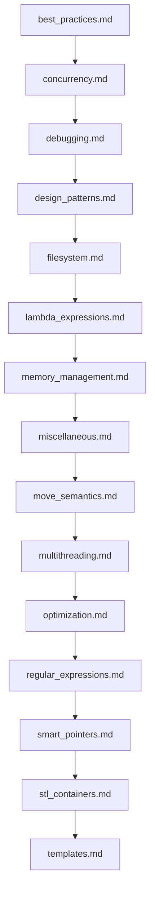

## Folder Map

| Type | Name | Purpose |
| --- | --- | --- |
| File | [best_practices.md](best_practices.md) | understand best practices |
| File | [concurrency.md](concurrency.md) | understand concurrency |
| File | [debugging.md](debugging.md) | understand debugging |
| File | [design_patterns.md](design_patterns.md) | understand design patterns |
| File | [filesystem.md](filesystem.md) | understand filesystem |
| File | [lambda_expressions.md](lambda_expressions.md) | understand lambda expressions |
| File | [memory_management.md](memory_management.md) | understand memory management |
| File | [miscellaneous.md](miscellaneous.md) | understand miscellaneous |
| File | [move_semantics.md](move_semantics.md) | understand move semantics |
| File | [multithreading.md](multithreading.md) | understand multithreading |
| File | [optimization.md](optimization.md) | understand optimization |
| File | [regular_expressions.md](regular_expressions.md) | understand regular expressions |
| File | [smart_pointers.md](smart_pointers.md) | understand smart pointers |
| File | [stl_containers.md](stl_containers.md) | understand stl containers |
| File | [templates.md](templates.md) | understand templates |

## Flowchart

# Others
This file mirrors the C++ repository structure for Java.

Content for this topic can be expanded here while keeping naming and traversal aligned across languages.
## Next Step

- Go to [best_practices.md](best_practices.md) to understand best practices.
