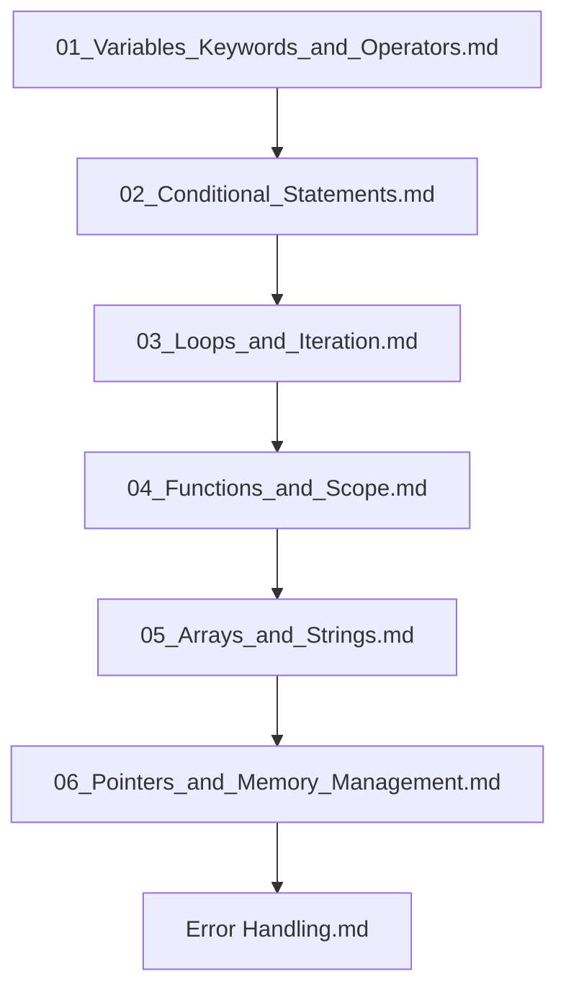

## Folder Map

| Type | Name | Purpose |
| --- | --- | --- |
| File | [01_Variables_Keywords_and_Operators.md](01_Variables_Keywords_and_Operators.md) | understand Variables Keywords and Operators |
| File | [02_Conditional_Statements.md](02_Conditional_Statements.md) | understand Conditional Statements |
| File | [03_Loops_and_Iteration.md](03_Loops_and_Iteration.md) | understand Loops and Iteration |
| File | [04_Functions_and_Scope.md](04_Functions_and_Scope.md) | understand Functions and Scope |
| File | [05_Arrays_and_Strings.md](05_Arrays_and_Strings.md) | understand Arrays and Strings |
| File | [06_Pointers_and_Memory_Management.md](06_Pointers_and_Memory_Management.md) | understand Pointers and Memory Management |
| File | [Error Handling.md](Error%20Handling.md) | understand Error Handling |

## Flowchart

# Basics
This README is the navigation index for this folder.
## Next Step

- Go to [01_Variables_Keywords_and_Operators.md](01_Variables_Keywords_and_Operators.md) to understand Java Variables, Keywords, and Operators.
