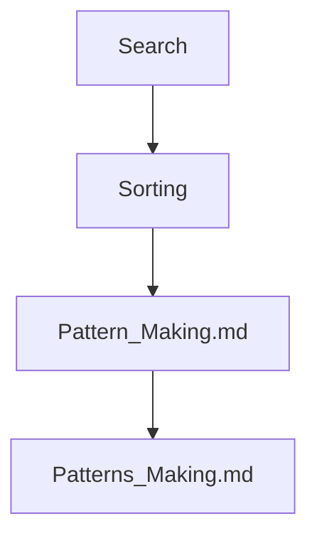

## Folder Map

| Type | Name | Purpose |
| --- | --- | --- |
| Folder | [Search](Search/README.md) | continue with the Search section |
| Folder | [Sorting](Sorting/README.md) | continue with the Sorting section |
| File | [Pattern_Making.md](Pattern_Making.md) | understand Pattern Making |
| File | [Patterns_Making.md](Patterns_Making.md) | understand Patterns Making |

## Flowchart

# Basic Problems
This README is the navigation index for this folder.
## Next Step

- Go to [Pattern_Making.md](Pattern_Making.md) to understand Pattern Programming Guide (Java).
