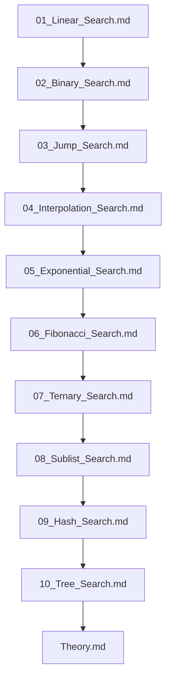

## Folder Map

| Type | Name | Purpose |
| --- | --- | --- |
| File | [01_Linear_Search.md](01_Linear_Search.md) | understand Linear Search |
| File | [02_Binary_Search.md](02_Binary_Search.md) | understand Binary Search |
| File | [03_Jump_Search.md](03_Jump_Search.md) | understand Jump Search |
| File | [04_Interpolation_Search.md](04_Interpolation_Search.md) | understand Interpolation Search |
| File | [05_Exponential_Search.md](05_Exponential_Search.md) | understand Exponential Search |
| File | [06_Fibonacci_Search.md](06_Fibonacci_Search.md) | understand Fibonacci Search |
| File | [07_Ternary_Search.md](07_Ternary_Search.md) | understand Ternary Search |
| File | [08_Sublist_Search.md](08_Sublist_Search.md) | understand Sublist Search |
| File | [09_Hash_Search.md](09_Hash_Search.md) | understand Hash Search |
| File | [10_Tree_Search.md](10_Tree_Search.md) | understand Tree Search |
| File | [Theory.md](Theory.md) | understand Theory |

## Flowchart

# Search
This file mirrors the C++ repository structure for Java.

Content for this topic can be expanded here while keeping naming and traversal aligned across languages.
## Next Step

- Go to [01_Linear_Search.md](01_Linear_Search.md) to understand Linear Search.
