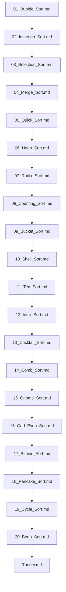

## Folder Map

| Type | Name | Purpose |
| --- | --- | --- |
| File | [01_Bubble_Sort.md](01_Bubble_Sort.md) | understand Bubble Sort |
| File | [02_Insertion_Sort.md](02_Insertion_Sort.md) | understand Insertion Sort |
| File | [03_Selection_Sort.md](03_Selection_Sort.md) | understand Selection Sort |
| File | [04_Merge_Sort.md](04_Merge_Sort.md) | understand Merge Sort |
| File | [05_Quick_Sort.md](05_Quick_Sort.md) | understand Quick Sort |
| File | [06_Heap_Sort.md](06_Heap_Sort.md) | understand Heap Sort |
| File | [07_Radix_Sort.md](07_Radix_Sort.md) | understand Radix Sort |
| File | [08_Counting_Sort.md](08_Counting_Sort.md) | understand Counting Sort |
| File | [09_Bucket_Sort.md](09_Bucket_Sort.md) | understand Bucket Sort |
| File | [10_Shell_Sort.md](10_Shell_Sort.md) | understand Shell Sort |
| File | [11_Tim_Sort.md](11_Tim_Sort.md) | understand Tim Sort |
| File | [12_Intro_Sort.md](12_Intro_Sort.md) | understand Intro Sort |
| File | [13_Cocktail_Sort.md](13_Cocktail_Sort.md) | understand Cocktail Sort |
| File | [14_Comb_Sort.md](14_Comb_Sort.md) | understand Comb Sort |
| File | [15_Gnome_Sort.md](15_Gnome_Sort.md) | understand Gnome Sort |
| File | [16_Odd_Even_Sort.md](16_Odd_Even_Sort.md) | understand Odd Even Sort |
| File | [17_Bitonic_Sort.md](17_Bitonic_Sort.md) | understand Bitonic Sort |
| File | [18_Pancake_Sort.md](18_Pancake_Sort.md) | understand Pancake Sort |
| File | [19_Cycle_Sort.md](19_Cycle_Sort.md) | understand Cycle Sort |
| File | [20_Bogo_Sort.md](20_Bogo_Sort.md) | understand Bogo Sort |
| File | [Theory.md](Theory.md) | understand Theory |

## Flowchart

# Sorting
This file mirrors the C++ repository structure for Java.

Content for this topic can be expanded here while keeping naming and traversal aligned across languages.
## Next Step

- Go to [01_Bubble_Sort.md](01_Bubble_Sort.md) to understand Bubble Sort.
