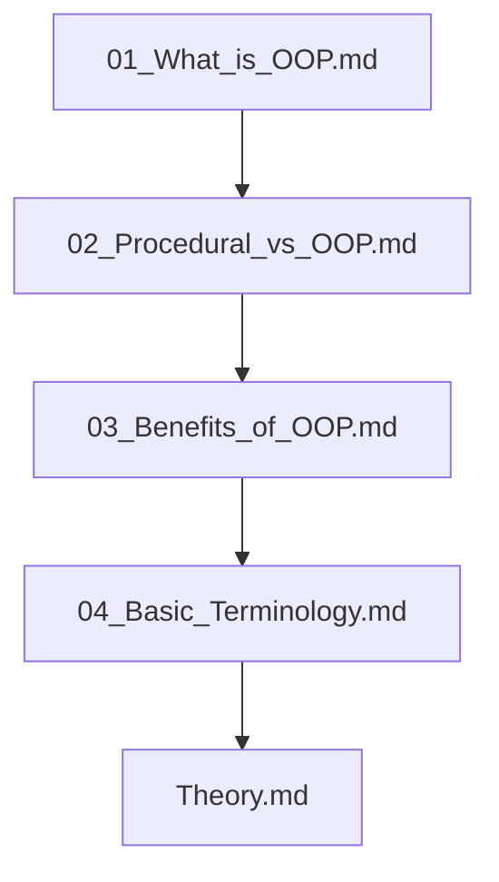

## Folder Map

| Type | Name | Purpose |
| --- | --- | --- |
| File | [01_What_is_OOP.md](01_What_is_OOP.md) | understand What is OOP |
| File | [02_Procedural_vs_OOP.md](02_Procedural_vs_OOP.md) | understand Procedural vs OOP |
| File | [03_Benefits_of_OOP.md](03_Benefits_of_OOP.md) | understand Benefits of OOP |
| File | [04_Basic_Terminology.md](04_Basic_Terminology.md) | understand Basic Terminology |
| File | [Theory.md](Theory.md) | understand Theory |

## Flowchart

# Introduction

This README is the navigation index for this folder.
## Next Step

- Go to [01_What_is_OOP.md](01_What_is_OOP.md) to understand What is OOP.
