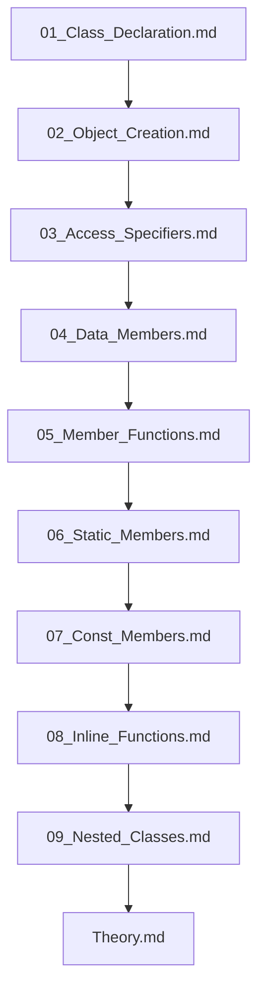

## Folder Map

| Type | Name | Purpose |
| --- | --- | --- |
| File | [01_Class_Declaration.md](01_Class_Declaration.md) | understand Class Declaration |
| File | [02_Object_Creation.md](02_Object_Creation.md) | understand Object Creation |
| File | [03_Access_Specifiers.md](03_Access_Specifiers.md) | understand Access Specifiers |
| File | [04_Data_Members.md](04_Data_Members.md) | understand Data Members |
| File | [05_Member_Functions.md](05_Member_Functions.md) | understand Member Functions |
| File | [06_Static_Members.md](06_Static_Members.md) | understand Static Members |
| File | [07_Const_Members.md](07_Const_Members.md) | understand Const Members |
| File | [08_Inline_Functions.md](08_Inline_Functions.md) | understand Inline Functions |
| File | [09_Nested_Classes.md](09_Nested_Classes.md) | understand Nested Classes |
| File | [Theory.md](Theory.md) | understand Theory |

## Flowchart

# Classes and Objects

This README is the navigation index for this folder.
## Next Step

- Go to [01_Class_Declaration.md](01_Class_Declaration.md) to understand Class Declaration.
