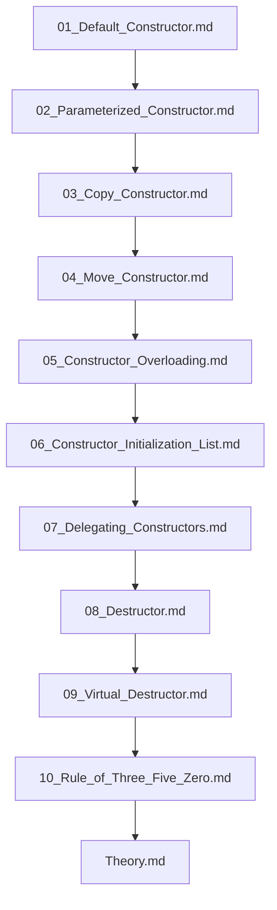

## Folder Map

| Type | Name | Purpose |
| --- | --- | --- |
| File | [01_Default_Constructor.md](01_Default_Constructor.md) | understand Default Constructor |
| File | [02_Parameterized_Constructor.md](02_Parameterized_Constructor.md) | understand Parameterized Constructor |
| File | [03_Copy_Constructor.md](03_Copy_Constructor.md) | understand Copy Constructor |
| File | [04_Move_Constructor.md](04_Move_Constructor.md) | understand Move Constructor |
| File | [05_Constructor_Overloading.md](05_Constructor_Overloading.md) | understand Constructor Overloading |
| File | [06_Constructor_Initialization_List.md](06_Constructor_Initialization_List.md) | understand Constructor Initialization List |
| File | [07_Delegating_Constructors.md](07_Delegating_Constructors.md) | understand Delegating Constructors |
| File | [08_Destructor.md](08_Destructor.md) | understand Destructor |
| File | [09_Virtual_Destructor.md](09_Virtual_Destructor.md) | understand Virtual Destructor |
| File | [10_Rule_of_Three_Five_Zero.md](10_Rule_of_Three_Five_Zero.md) | understand Rule of Three Five Zero |
| File | [Theory.md](Theory.md) | understand Theory |

## Flowchart

# Constructors and Destructors

This README is the navigation index for this folder.
## Next Step

- Go to [01_Default_Constructor.md](01_Default_Constructor.md) to understand Default Constructor.
