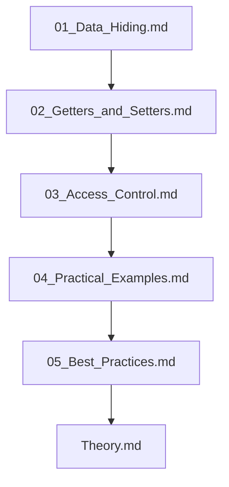

## Folder Map

| Type | Name | Purpose |
| --- | --- | --- |
| File | [01_Data_Hiding.md](01_Data_Hiding.md) | understand Data Hiding |
| File | [02_Getters_and_Setters.md](02_Getters_and_Setters.md) | understand Getters and Setters |
| File | [03_Access_Control.md](03_Access_Control.md) | understand Access Control |
| File | [04_Practical_Examples.md](04_Practical_Examples.md) | understand Practical Examples |
| File | [05_Best_Practices.md](05_Best_Practices.md) | understand Best Practices |
| File | [Theory.md](Theory.md) | understand Theory |

## Flowchart

# Encapsulation

This README is the navigation index for this folder.
## Next Step

- Go to [01_Data_Hiding.md](01_Data_Hiding.md) to understand Data Hiding.
