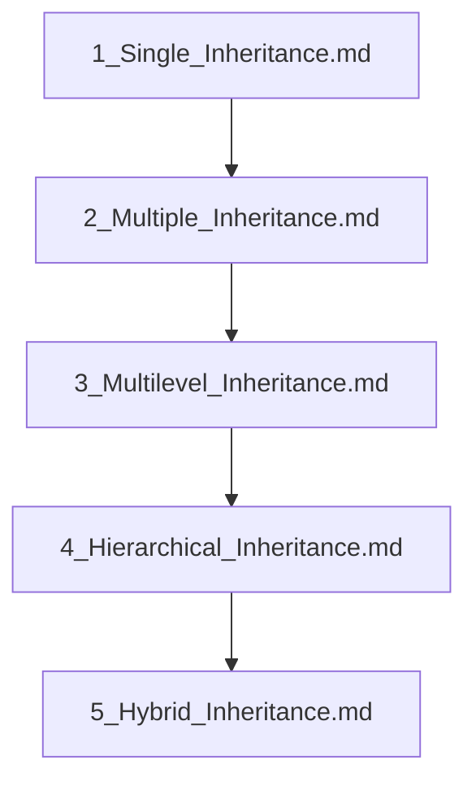

## Folder Map

| Type | Name | Purpose |
| --- | --- | --- |
| File | [1_Single_Inheritance.md](1_Single_Inheritance.md) | understand Single Inheritance |
| File | [2_Multiple_Inheritance.md](2_Multiple_Inheritance.md) | understand Multiple Inheritance |
| File | [3_Multilevel_Inheritance.md](3_Multilevel_Inheritance.md) | understand Multilevel Inheritance |
| File | [4_Hierarchical_Inheritance.md](4_Hierarchical_Inheritance.md) | understand Hierarchical Inheritance |
| File | [5_Hybrid_Inheritance.md](5_Hybrid_Inheritance.md) | understand Hybrid Inheritance |

## Flowchart

# Types of Inheritance

This README is the navigation index for this folder.
## Next Step

- Go to [1_Single_Inheritance.md](1_Single_Inheritance.md) to understand Single Inheritance.
