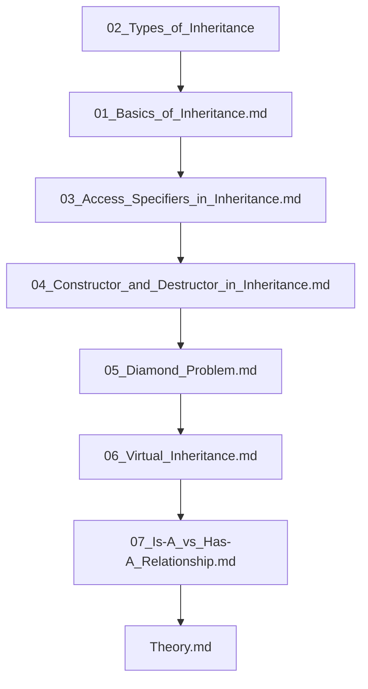

## Folder Map

| Type | Name | Purpose |
| --- | --- | --- |
| Folder | [02_Types_of_Inheritance](02_Types_of_Inheritance/README.md) | continue with the Types of Inheritance section |
| File | [01_Basics_of_Inheritance.md](01_Basics_of_Inheritance.md) | understand Basics of Inheritance |
| File | [03_Access_Specifiers_in_Inheritance.md](03_Access_Specifiers_in_Inheritance.md) | understand Access Specifiers in Inheritance |
| File | [04_Constructor_and_Destructor_in_Inheritance.md](04_Constructor_and_Destructor_in_Inheritance.md) | understand Constructor and Destructor in Inheritance |
| File | [05_Diamond_Problem.md](05_Diamond_Problem.md) | understand Diamond Problem |
| File | [06_Virtual_Inheritance.md](06_Virtual_Inheritance.md) | understand Virtual Inheritance |
| File | [07_Is-A_vs_Has-A_Relationship.md](07_Is-A_vs_Has-A_Relationship.md) | understand Is A vs Has A Relationship |
| File | [Theory.md](Theory.md) | understand Theory |

## Flowchart

# Inheritance

This README is the navigation index for this folder.
## Next Step

- Go to [01_Basics_of_Inheritance.md](01_Basics_of_Inheritance.md) to understand Basics of Inheritance.
