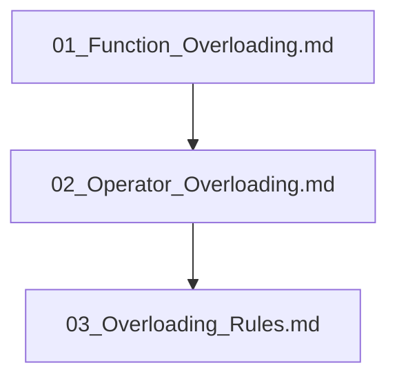

## Folder Map

| Type | Name | Purpose |
| --- | --- | --- |
| File | [01_Function_Overloading.md](01_Function_Overloading.md) | understand Function Overloading |
| File | [02_Operator_Overloading.md](02_Operator_Overloading.md) | understand Operator Overloading |
| File | [03_Overloading_Rules.md](03_Overloading_Rules.md) | understand Overloading Rules |

## Flowchart

# Compile Time Polymorphism

This README is the navigation index for this folder.
## Next Step

- Go to [01_Function_Overloading.md](01_Function_Overloading.md) to understand Function Overloading.
