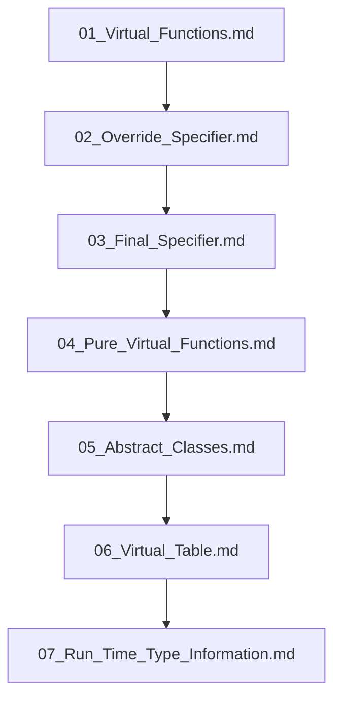

## Folder Map

| Type | Name | Purpose |
| --- | --- | --- |
| File | [01_Virtual_Functions.md](01_Virtual_Functions.md) | understand Virtual Functions |
| File | [02_Override_Specifier.md](02_Override_Specifier.md) | understand Override Specifier |
| File | [03_Final_Specifier.md](03_Final_Specifier.md) | understand Final Specifier |
| File | [04_Pure_Virtual_Functions.md](04_Pure_Virtual_Functions.md) | understand Pure Virtual Functions |
| File | [05_Abstract_Classes.md](05_Abstract_Classes.md) | understand Abstract Classes |
| File | [06_Virtual_Table.md](06_Virtual_Table.md) | understand Virtual Table |
| File | [07_Run_Time_Type_Information.md](07_Run_Time_Type_Information.md) | understand Run Time Type Information |

## Flowchart

# Run Time Polymorphism

This README is the navigation index for this folder.
## Next Step

- Go to [01_Virtual_Functions.md](01_Virtual_Functions.md) to understand Virtual Functions.
