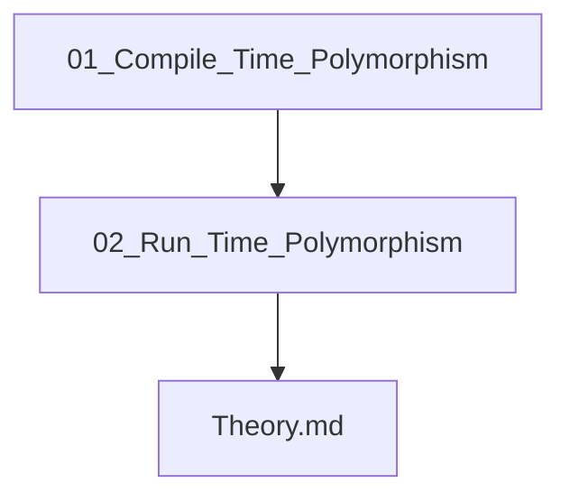

## Folder Map

| Type | Name | Purpose |
| --- | --- | --- |
| Folder | [01_Compile_Time_Polymorphism](01_Compile_Time_Polymorphism/README.md) | continue with the Compile Time Polymorphism section |
| Folder | [02_Run_Time_Polymorphism](02_Run_Time_Polymorphism/README.md) | continue with the Run Time Polymorphism section |
| File | [Theory.md](Theory.md) | understand Theory |

## Flowchart

# Polymorphism

This README is the navigation index for this folder.
## Next Step

- Go to [Theory.md](Theory.md) to understand Theory.
