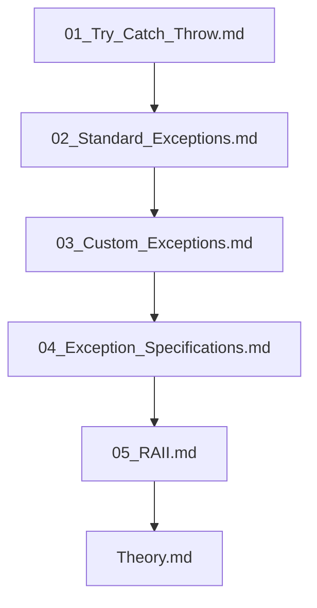

## Folder Map

| Type | Name | Purpose |
| --- | --- | --- |
| File | [01_Try_Catch_Throw.md](01_Try_Catch_Throw.md) | understand Try Catch Throw |
| File | [02_Standard_Exceptions.md](02_Standard_Exceptions.md) | understand Standard Exceptions |
| File | [03_Custom_Exceptions.md](03_Custom_Exceptions.md) | understand Custom Exceptions |
| File | [04_Exception_Specifications.md](04_Exception_Specifications.md) | understand Exception Specifications |
| File | [05_RAII.md](05_RAII.md) | understand RAII |
| File | [Theory.md](Theory.md) | understand Theory |

## Flowchart

# Exception Handling in OOP

This README is the navigation index for this folder.
## Next Step

- Go to [01_Try_Catch_Throw.md](01_Try_Catch_Throw.md) to understand Try Catch Throw.
