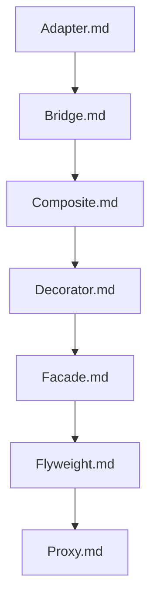

## Folder Map

| Type | Name | Purpose |
| --- | --- | --- |
| File | [Adapter.md](Adapter.md) | understand Adapter |
| File | [Bridge.md](Bridge.md) | understand Bridge |
| File | [Composite.md](Composite.md) | understand Composite |
| File | [Decorator.md](Decorator.md) | understand Decorator |
| File | [Facade.md](Facade.md) | understand Facade |
| File | [Flyweight.md](Flyweight.md) | understand Flyweight |
| File | [Proxy.md](Proxy.md) | understand Proxy |

## Flowchart

# Structural Patterns

This README is the navigation index for this folder.
## Next Step

- Go to [Adapter.md](Adapter.md) to understand Adapter.
