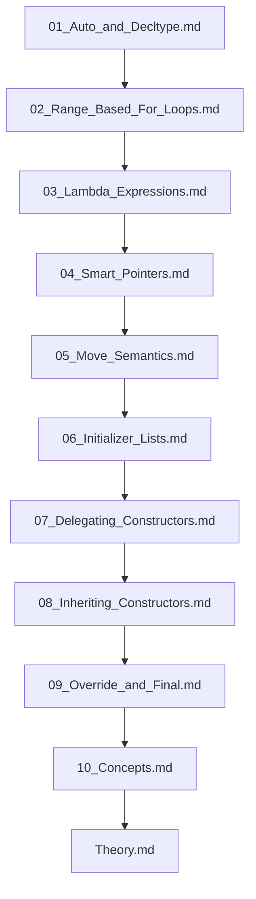

## Folder Map

| Type | Name | Purpose |
| --- | --- | --- |
| File | [01_Auto_and_Decltype.md](01_Auto_and_Decltype.md) | understand Auto and Decltype |
| File | [02_Range_Based_For_Loops.md](02_Range_Based_For_Loops.md) | understand Range Based For Loops |
| File | [03_Lambda_Expressions.md](03_Lambda_Expressions.md) | understand Lambda Expressions |
| File | [04_Smart_Pointers.md](04_Smart_Pointers.md) | understand Smart Pointers |
| File | [05_Move_Semantics.md](05_Move_Semantics.md) | understand Move Semantics |
| File | [06_Initializer_Lists.md](06_Initializer_Lists.md) | understand Initializer Lists |
| File | [07_Delegating_Constructors.md](07_Delegating_Constructors.md) | understand Delegating Constructors |
| File | [08_Inheriting_Constructors.md](08_Inheriting_Constructors.md) | understand Inheriting Constructors |
| File | [09_Override_and_Final.md](09_Override_and_Final.md) | understand Override and Final |
| File | [10_Concepts.md](10_Concepts.md) | understand Concepts |
| File | [Theory.md](Theory.md) | understand Theory |

## Flowchart

# Modern Cpp OOP Features

This README is the navigation index for this folder.
## Next Step

- Go to [01_Auto_and_Decltype.md](01_Auto_and_Decltype.md) to understand Auto and Decltype.
