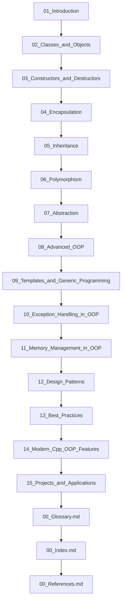

## Folder Map

| Type | Name | Purpose |
| --- | --- | --- |
| Folder | [01_Introduction](01_Introduction/README.md) | continue with the Introduction section |
| Folder | [02_Classes_and_Objects](02_Classes_and_Objects/README.md) | continue with the Classes and Objects section |
| Folder | [03_Constructors_and_Destructors](03_Constructors_and_Destructors/README.md) | continue with the Constructors and Destructors section |
| Folder | [04_Encapsulation](04_Encapsulation/README.md) | continue with the Encapsulation section |
| Folder | [05_Inheritance](05_Inheritance/README.md) | continue with the Inheritance section |
| Folder | [06_Polymorphism](06_Polymorphism/README.md) | continue with the Polymorphism section |
| Folder | [07_Abstraction](07_Abstraction/README.md) | continue with the Abstraction section |
| Folder | [08_Advanced_OOP](08_Advanced_OOP/README.md) | continue with the Advanced OOP section |
| Folder | [09_Templates_and_Generic_Programming](09_Templates_and_Generic_Programming/README.md) | continue with the Templates and Generic Programming section |
| Folder | [10_Exception_Handling_in_OOP](10_Exception_Handling_in_OOP/README.md) | continue with the Exception Handling in OOP section |
| Folder | [11_Memory_Management_in_OOP](11_Memory_Management_in_OOP/README.md) | continue with the Memory Management in OOP section |
| Folder | [12_Design_Patterns](12_Design_Patterns/README.md) | continue with the Design Patterns section |
| Folder | [13_Best_Practices](13_Best_Practices/README.md) | continue with the Best Practices section |
| Folder | [14_Modern_Cpp_OOP_Features](14_Modern_Cpp_OOP_Features/README.md) | continue with the Modern Cpp OOP Features section |
| Folder | [15_Projects_and_Applications](15_Projects_and_Applications/README.md) | continue with the Projects and Applications section |
| File | [00_Glossary.md](00_Glossary.md) | understand Glossary |
| File | [00_Index.md](00_Index.md) | understand Index |
| File | [00_References.md](00_References.md) | understand References |

## Flowchart

# OOPS
This file mirrors the C++ repository structure for Java.

Content for this topic can be expanded here while keeping naming and traversal aligned across languages.
## Next Step

- Go to [00_Glossary.md](00_Glossary.md) to understand Glossary.
