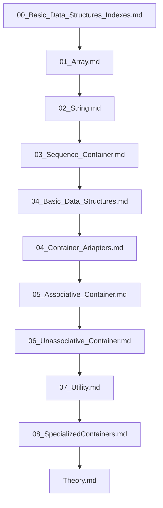

## Folder Map

| Type | Name | Purpose |
| --- | --- | --- |
| File | [00_Basic_Data_Structures_Indexes.md](00_Basic_Data_Structures_Indexes.md) | understand Basic Data Structures Indexes |
| File | [01_Array.md](01_Array.md) | understand Array |
| File | [02_String.md](02_String.md) | understand String |
| File | [03_Sequence_Container.md](03_Sequence_Container.md) | understand Sequence Container |
| File | [04_Basic_Data_Structures.md](04_Basic_Data_Structures.md) | understand Basic Data Structures |
| File | [04_Container_Adapters.md](04_Container_Adapters.md) | understand Container Adapters |
| File | [05_Associative_Container.md](05_Associative_Container.md) | understand Associative Container |
| File | [06_Unassociative_Container.md](06_Unassociative_Container.md) | understand Unassociative Container |
| File | [07_Utility.md](07_Utility.md) | understand Utility |
| File | [08_SpecializedContainers.md](08_SpecializedContainers.md) | understand SpecializedContainers |
| File | [Theory.md](Theory.md) | understand Theory |

## Flowchart

# Data Structures
This README is the navigation index for this folder.
## Next Step

- Go to [00_Basic_Data_Structures_Indexes.md](00_Basic_Data_Structures_Indexes.md) to understand Basic Data Structures Indexes.
