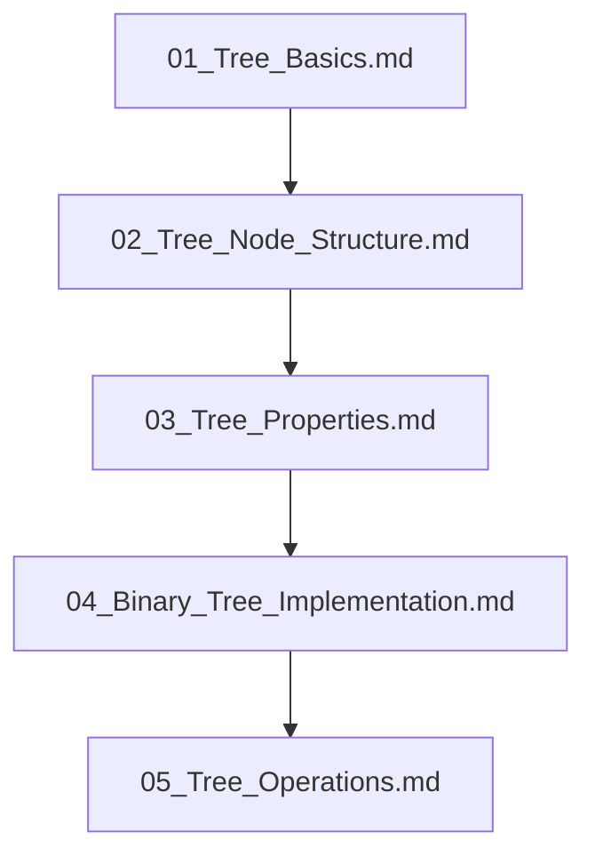

## Folder Map

| Type | Name | Purpose |
| --- | --- | --- |
| File | [01_Tree_Basics.md](01_Tree_Basics.md) | understand Tree Basics |
| File | [02_Tree_Node_Structure.md](02_Tree_Node_Structure.md) | understand Tree Node Structure |
| File | [03_Tree_Properties.md](03_Tree_Properties.md) | understand Tree Properties |
| File | [04_Binary_Tree_Implementation.md](04_Binary_Tree_Implementation.md) | understand Binary Tree Implementation |
| File | [05_Tree_Operations.md](05_Tree_Operations.md) | understand Tree Operations |

## Flowchart

# Binary Trees
This file mirrors the C++ repository structure for Java.

Content for this topic can be expanded here while keeping naming and traversal aligned across languages.
## Next Step

- Go to [01_Tree_Basics.md](01_Tree_Basics.md) to understand Tree Basics.
