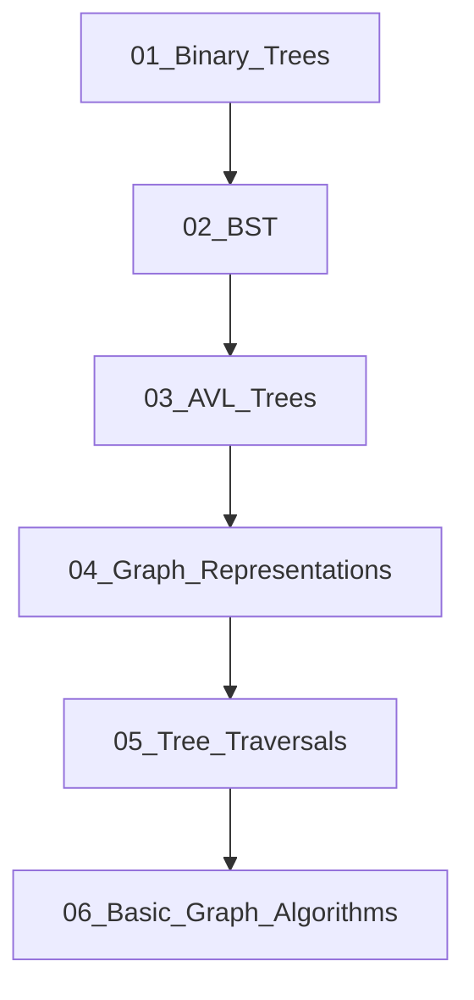

## Folder Map

| Type | Name | Purpose |
| --- | --- | --- |
| Folder | [01_Binary_Trees](01_Binary_Trees/README.md) | continue with the Binary Trees section |
| Folder | [02_BST](02_BST/README.md) | continue with the BST section |
| Folder | [03_AVL_Trees](03_AVL_Trees/README.md) | continue with the AVL Trees section |
| Folder | [04_Graph_Representations](04_Graph_Representations/README.md) | continue with the Graph Representations section |
| Folder | [05_Tree_Traversals](05_Tree_Traversals/README.md) | continue with the Tree Traversals section |
| Folder | [06_Basic_Graph_Algorithms](06_Basic_Graph_Algorithms/README.md) | continue with the Basic Graph Algorithms section |

## Flowchart

# Trees and Graphs
This file mirrors the C++ repository structure for Java.

Content for this topic can be expanded here while keeping naming and traversal aligned across languages.
## Next Step

- Go to [README.md](01_Binary_Trees/README.md) to understand Binary Trees.
