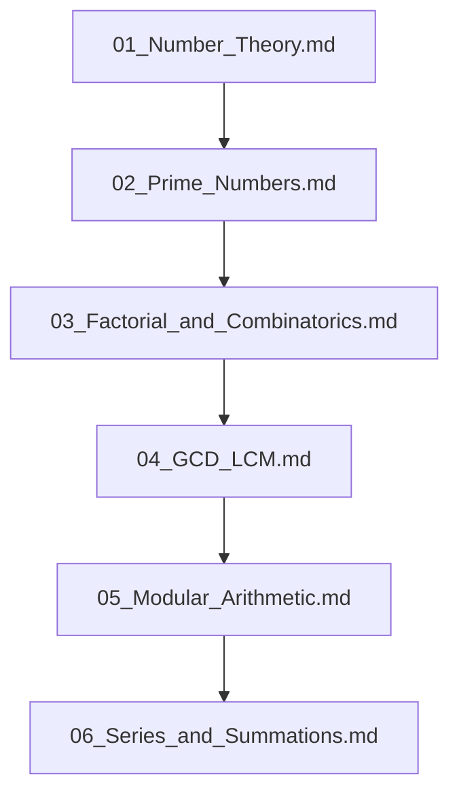

## Folder Map

| Type | Name | Purpose |
| --- | --- | --- |
| File | [01_Number_Theory.md](01_Number_Theory.md) | understand Number Theory |
| File | [02_Prime_Numbers.md](02_Prime_Numbers.md) | understand Prime Numbers |
| File | [03_Factorial_and_Combinatorics.md](03_Factorial_and_Combinatorics.md) | understand Factorial and Combinatorics |
| File | [04_GCD_LCM.md](04_GCD_LCM.md) | understand GCD LCM |
| File | [05_Modular_Arithmetic.md](05_Modular_Arithmetic.md) | understand Modular Arithmetic |
| File | [06_Series_and_Summations.md](06_Series_and_Summations.md) | understand Series and Summations |

## Flowchart

# Mathematical Problems
This file mirrors the C++ repository structure for Java.

Content for this topic can be expanded here while keeping naming and traversal aligned across languages.
## Next Step

- Go to [01_Number_Theory.md](01_Number_Theory.md) to understand Number Theory.
