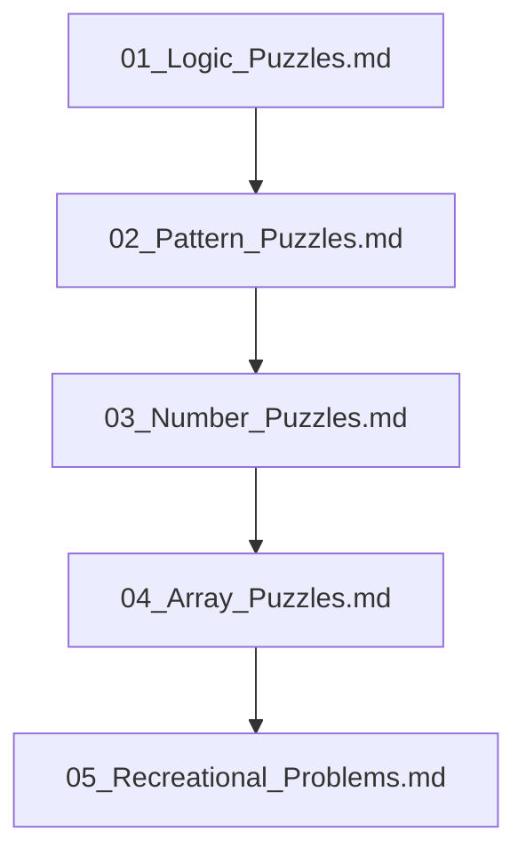

## Folder Map

| Type | Name | Purpose |
| --- | --- | --- |
| File | [01_Logic_Puzzles.md](01_Logic_Puzzles.md) | understand Logic Puzzles |
| File | [02_Pattern_Puzzles.md](02_Pattern_Puzzles.md) | understand Pattern Puzzles |
| File | [03_Number_Puzzles.md](03_Number_Puzzles.md) | understand Number Puzzles |
| File | [04_Array_Puzzles.md](04_Array_Puzzles.md) | understand Array Puzzles |
| File | [05_Recreational_Problems.md](05_Recreational_Problems.md) | understand Recreational Problems |

## Flowchart

# Puzzle Problems
This file mirrors the C++ repository structure for Java.

Content for this topic can be expanded here while keeping naming and traversal aligned across languages.
## Next Step

- Go to [01_Logic_Puzzles.md](01_Logic_Puzzles.md) to understand Logic Puzzles.
