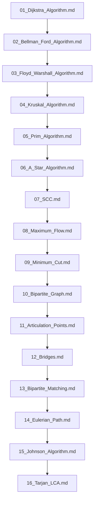

## Folder Map

| Type | Name | Purpose |
| --- | --- | --- |
| File | [01_Dijkstra_Algorithm.md](01_Dijkstra_Algorithm.md) | understand Dijkstra Algorithm |
| File | [02_Bellman_Ford_Algorithm.md](02_Bellman_Ford_Algorithm.md) | understand Bellman Ford Algorithm |
| File | [03_Floyd_Warshall_Algorithm.md](03_Floyd_Warshall_Algorithm.md) | understand Floyd Warshall Algorithm |
| File | [04_Kruskal_Algorithm.md](04_Kruskal_Algorithm.md) | understand Kruskal Algorithm |
| File | [05_Prim_Algorithm.md](05_Prim_Algorithm.md) | understand Prim Algorithm |
| File | [06_A_Star_Algorithm.md](06_A_Star_Algorithm.md) | understand A Star Algorithm |
| File | [07_SCC.md](07_SCC.md) | understand SCC |
| File | [08_Maximum_Flow.md](08_Maximum_Flow.md) | understand Maximum Flow |
| File | [09_Minimum_Cut.md](09_Minimum_Cut.md) | understand Minimum Cut |
| File | [10_Bipartite_Graph.md](10_Bipartite_Graph.md) | understand Bipartite Graph |
| File | [11_Articulation_Points.md](11_Articulation_Points.md) | understand Articulation Points |
| File | [12_Bridges.md](12_Bridges.md) | understand Bridges |
| File | [13_Bipartite_Matching.md](13_Bipartite_Matching.md) | understand Bipartite Matching |
| File | [14_Eulerian_Path.md](14_Eulerian_Path.md) | understand Eulerian Path |
| File | [15_Johnson_Algorithm.md](15_Johnson_Algorithm.md) | understand Johnson Algorithm |
| File | [16_Tarjan_LCA.md](16_Tarjan_LCA.md) | understand Tarjan LCA |

## Flowchart

# Graph Algorithms
This file mirrors the C++ repository structure for Java.

Content for this topic can be expanded here while keeping naming and traversal aligned across languages.
## Next Step

- Go to [01_Dijkstra_Algorithm.md](01_Dijkstra_Algorithm.md) to understand Dijkstra Algorithm.
