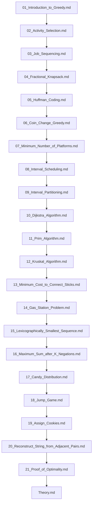

## Folder Map

| Type | Name | Purpose |
| --- | --- | --- |
| File | [01_Introduction_to_Greedy.md](01_Introduction_to_Greedy.md) | understand Introduction to Greedy |
| File | [02_Activity_Selection.md](02_Activity_Selection.md) | understand Activity Selection |
| File | [03_Job_Sequencing.md](03_Job_Sequencing.md) | understand Job Sequencing |
| File | [04_Fractional_Knapsack.md](04_Fractional_Knapsack.md) | understand Fractional Knapsack |
| File | [05_Huffman_Coding.md](05_Huffman_Coding.md) | understand Huffman Coding |
| File | [06_Coin_Change_Greedy.md](06_Coin_Change_Greedy.md) | understand Coin Change Greedy |
| File | [07_Minimum_Number_of_Platforms.md](07_Minimum_Number_of_Platforms.md) | understand Minimum Number of Platforms |
| File | [08_Interval_Scheduling.md](08_Interval_Scheduling.md) | understand Interval Scheduling |
| File | [09_Interval_Partitioning.md](09_Interval_Partitioning.md) | understand Interval Partitioning |
| File | [10_Dijkstra_Algorithm.md](10_Dijkstra_Algorithm.md) | understand Dijkstra Algorithm |
| File | [11_Prim_Algorithm.md](11_Prim_Algorithm.md) | understand Prim Algorithm |
| File | [12_Kruskal_Algorithm.md](12_Kruskal_Algorithm.md) | understand Kruskal Algorithm |
| File | [13_Minimum_Cost_to_Connect_Sticks.md](13_Minimum_Cost_to_Connect_Sticks.md) | understand Minimum Cost to Connect Sticks |
| File | [14_Gas_Station_Problem.md](14_Gas_Station_Problem.md) | understand Gas Station Problem |
| File | [15_Lexicographically_Smallest_Sequence.md](15_Lexicographically_Smallest_Sequence.md) | understand Lexicographically Smallest Sequence |
| File | [16_Maximum_Sum_after_K_Negations.md](16_Maximum_Sum_after_K_Negations.md) | understand Maximum Sum after K Negations |
| File | [17_Candy_Distribution.md](17_Candy_Distribution.md) | understand Candy Distribution |
| File | [18_Jump_Game.md](18_Jump_Game.md) | understand Jump Game |
| File | [19_Assign_Cookies.md](19_Assign_Cookies.md) | understand Assign Cookies |
| File | [20_Reconstruct_String_from_Adjacent_Pairs.md](20_Reconstruct_String_from_Adjacent_Pairs.md) | understand Reconstruct String from Adjacent Pairs |
| File | [21_Proof_of_Optimality.md](21_Proof_of_Optimality.md) | understand Proof of Optimality |
| File | [Theory.md](Theory.md) | understand Theory |

## Flowchart

# Greedy Algorithms
This file mirrors the C++ repository structure for Java.

Content for this topic can be expanded here while keeping naming and traversal aligned across languages.
## Next Step

- Go to [01_Introduction_to_Greedy.md](01_Introduction_to_Greedy.md) to understand Introduction to Greedy.
