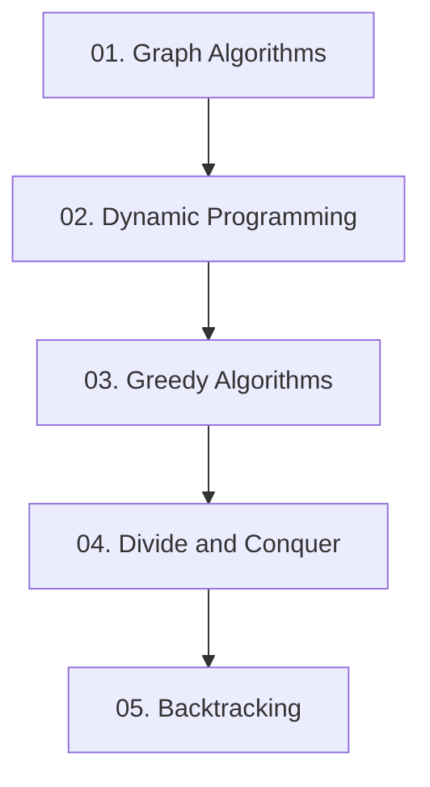

## Folder Map

| Type | Name | Purpose |
| --- | --- | --- |
| Folder | [01. Graph Algorithms](01.%20Graph%20Algorithms/README.md) | continue with the Graph Algorithms section |
| Folder | [02. Dynamic Programming](02.%20Dynamic%20Programming/README.md) | continue with the Dynamic Programming section |
| Folder | [03. Greedy Algorithms](03.%20Greedy%20Algorithms/README.md) | continue with the Greedy Algorithms section |
| Folder | [04. Divide and Conquer](04.%20Divide%20and%20Conquer/README.md) | continue with the Divide and Conquer section |
| Folder | [05. Backtracking](05.%20Backtracking/README.md) | continue with the Backtracking section |

## Flowchart

# Algorithms
This file mirrors the C++ repository structure for Java.

Content for this topic can be expanded here while keeping naming and traversal aligned across languages.
## Next Step

- Go to [README.md](01.%20Graph%20Algorithms/README.md) to understand Graph Algorithms.
