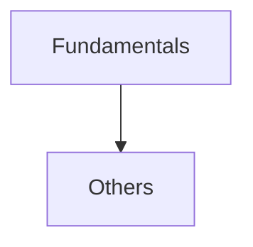

## Folder Map

| Type | Name | Purpose |
| --- | --- | --- |
| Folder | [Fundamentals](Fundamentals/README.md) | continue with the Fundamentals section |
| Folder | [Others](Others/README.md) | continue with the Others section |

## Flowchart

# Headers and Libraries
This file mirrors the C++ repository structure for Python.

Content for this topic can be expanded here while keeping naming and traversal aligned across languages.
## Next Step

- Go to [README.md](Fundamentals/README.md) to understand Fundamentals.
