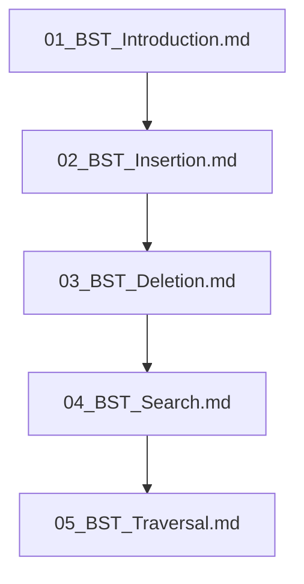

## Folder Map

| Type | Name | Purpose |
| --- | --- | --- |
| File | [01_BST_Introduction.md](01_BST_Introduction.md) | understand BST Introduction |
| File | [02_BST_Insertion.md](02_BST_Insertion.md) | understand BST Insertion |
| File | [03_BST_Deletion.md](03_BST_Deletion.md) | understand BST Deletion |
| File | [04_BST_Search.md](04_BST_Search.md) | understand BST Search |
| File | [05_BST_Traversal.md](05_BST_Traversal.md) | understand BST Traversal |

## Flowchart

# BST
This file mirrors the C++ repository structure for Python.

Content for this topic can be expanded here while keeping naming and traversal aligned across languages.
## Next Step

- Go to [01_BST_Introduction.md](01_BST_Introduction.md) to understand BST Introduction.
