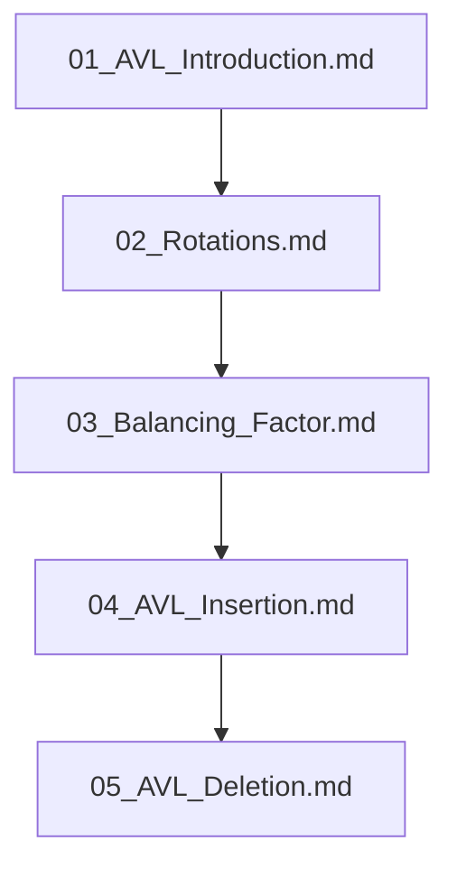

## Folder Map

| Type | Name | Purpose |
| --- | --- | --- |
| File | [01_AVL_Introduction.md](01_AVL_Introduction.md) | understand AVL Introduction |
| File | [02_Rotations.md](02_Rotations.md) | understand Rotations |
| File | [03_Balancing_Factor.md](03_Balancing_Factor.md) | understand Balancing Factor |
| File | [04_AVL_Insertion.md](04_AVL_Insertion.md) | understand AVL Insertion |
| File | [05_AVL_Deletion.md](05_AVL_Deletion.md) | understand AVL Deletion |

## Flowchart

# AVL Trees
This file mirrors the C++ repository structure for Python.

Content for this topic can be expanded here while keeping naming and traversal aligned across languages.
## Next Step

- Go to [01_AVL_Introduction.md](01_AVL_Introduction.md) to understand AVL Introduction.
