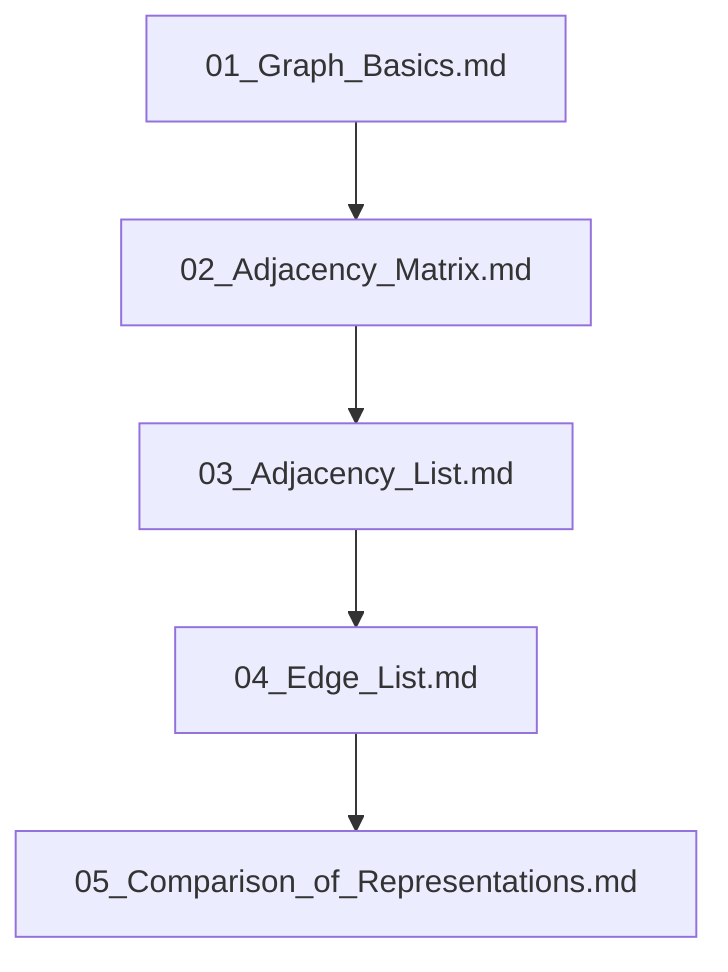

## Folder Map

| Type | Name | Purpose |
| --- | --- | --- |
| File | [01_Graph_Basics.md](01_Graph_Basics.md) | understand Graph Basics |
| File | [02_Adjacency_Matrix.md](02_Adjacency_Matrix.md) | understand Adjacency Matrix |
| File | [03_Adjacency_List.md](03_Adjacency_List.md) | understand Adjacency List |
| File | [04_Edge_List.md](04_Edge_List.md) | understand Edge List |
| File | [05_Comparison_of_Representations.md](05_Comparison_of_Representations.md) | understand Comparison of Representations |

## Flowchart

# Graph Representations
This file mirrors the C++ repository structure for Python.

Content for this topic can be expanded here while keeping naming and traversal aligned across languages.
## Next Step

- Go to [01_Graph_Basics.md](01_Graph_Basics.md) to understand Graph Basics.
