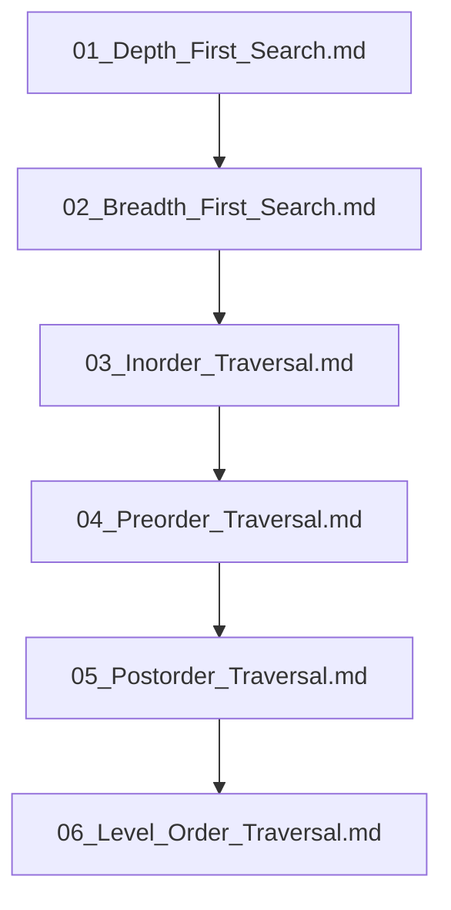

## Folder Map

| Type | Name | Purpose |
| --- | --- | --- |
| File | [01_Depth_First_Search.md](01_Depth_First_Search.md) | understand Depth First Search |
| File | [02_Breadth_First_Search.md](02_Breadth_First_Search.md) | understand Breadth First Search |
| File | [03_Inorder_Traversal.md](03_Inorder_Traversal.md) | understand Inorder Traversal |
| File | [04_Preorder_Traversal.md](04_Preorder_Traversal.md) | understand Preorder Traversal |
| File | [05_Postorder_Traversal.md](05_Postorder_Traversal.md) | understand Postorder Traversal |
| File | [06_Level_Order_Traversal.md](06_Level_Order_Traversal.md) | understand Level Order Traversal |

## Flowchart

# Tree Traversals
This file mirrors the C++ repository structure for Python.

Content for this topic can be expanded here while keeping naming and traversal aligned across languages.
## Next Step

- Go to [01_Depth_First_Search.md](01_Depth_First_Search.md) to understand Depth First Search.
