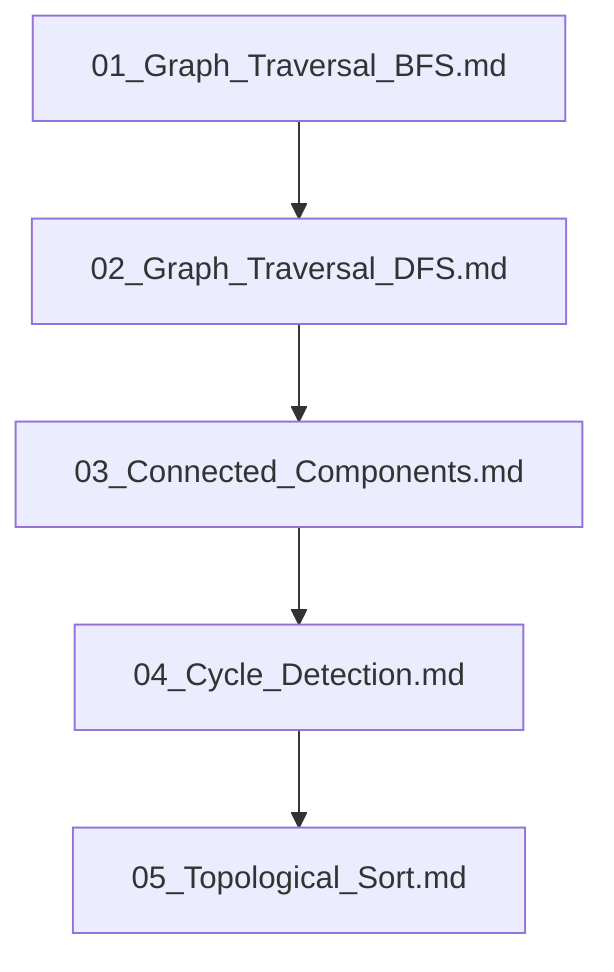

## Folder Map

| Type | Name | Purpose |
| --- | --- | --- |
| File | [01_Graph_Traversal_BFS.md](01_Graph_Traversal_BFS.md) | understand Graph Traversal BFS |
| File | [02_Graph_Traversal_DFS.md](02_Graph_Traversal_DFS.md) | understand Graph Traversal DFS |
| File | [03_Connected_Components.md](03_Connected_Components.md) | understand Connected Components |
| File | [04_Cycle_Detection.md](04_Cycle_Detection.md) | understand Cycle Detection |
| File | [05_Topological_Sort.md](05_Topological_Sort.md) | understand Topological Sort |

## Flowchart

# Basic Graph Algorithms
This file mirrors the C++ repository structure for Python.

Content for this topic can be expanded here while keeping naming and traversal aligned across languages.
## Next Step

- Go to [01_Graph_Traversal_BFS.md](01_Graph_Traversal_BFS.md) to understand Graph Traversal BFS.
