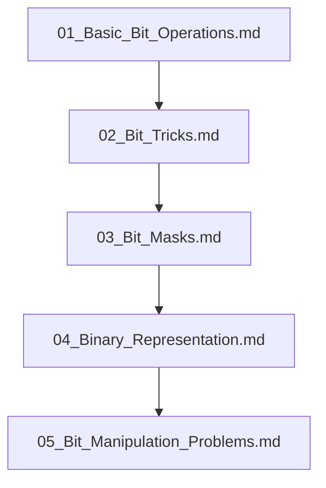

## Folder Map

| Type | Name | Purpose |
| --- | --- | --- |
| File | [01_Basic_Bit_Operations.md](01_Basic_Bit_Operations.md) | understand Basic Bit Operations |
| File | [02_Bit_Tricks.md](02_Bit_Tricks.md) | understand Bit Tricks |
| File | [03_Bit_Masks.md](03_Bit_Masks.md) | understand Bit Masks |
| File | [04_Binary_Representation.md](04_Binary_Representation.md) | understand Binary Representation |
| File | [05_Bit_Manipulation_Problems.md](05_Bit_Manipulation_Problems.md) | understand Bit Manipulation Problems |

## Flowchart

# Bit Manipulation
This file mirrors the C++ repository structure for Python.

Content for this topic can be expanded here while keeping naming and traversal aligned across languages.
## Next Step

- Go to [01_Basic_Bit_Operations.md](01_Basic_Bit_Operations.md) to understand Basic Bit Operations.
