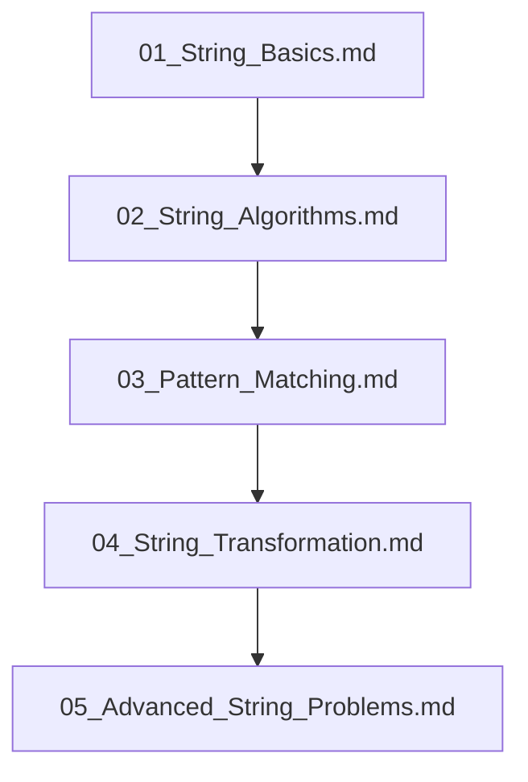

## Folder Map

| Type | Name | Purpose |
| --- | --- | --- |
| File | [01_String_Basics.md](01_String_Basics.md) | understand String Basics |
| File | [02_String_Algorithms.md](02_String_Algorithms.md) | understand String Algorithms |
| File | [03_Pattern_Matching.md](03_Pattern_Matching.md) | understand Pattern Matching |
| File | [04_String_Transformation.md](04_String_Transformation.md) | understand String Transformation |
| File | [05_Advanced_String_Problems.md](05_Advanced_String_Problems.md) | understand Advanced String Problems |

## Flowchart

# String Problems
This file mirrors the C++ repository structure for Python.

Content for this topic can be expanded here while keeping naming and traversal aligned across languages.
## Next Step

- Go to [01_String_Basics.md](01_String_Basics.md) to understand String Basics.
