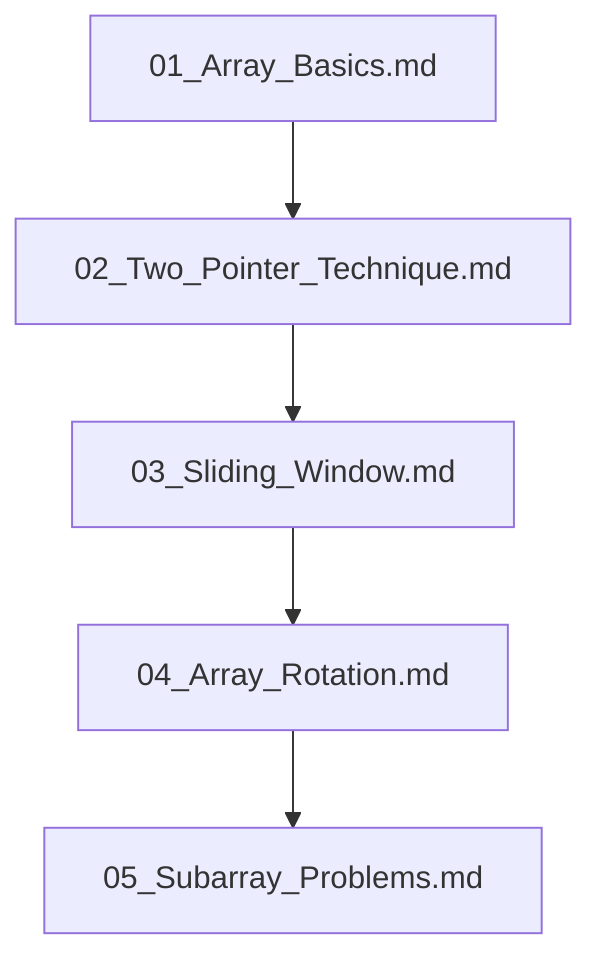

## Folder Map

| Type | Name | Purpose |
| --- | --- | --- |
| File | [01_Array_Basics.md](01_Array_Basics.md) | understand Array Basics |
| File | [02_Two_Pointer_Technique.md](02_Two_Pointer_Technique.md) | understand Two Pointer Technique |
| File | [03_Sliding_Window.md](03_Sliding_Window.md) | understand Sliding Window |
| File | [04_Array_Rotation.md](04_Array_Rotation.md) | understand Array Rotation |
| File | [05_Subarray_Problems.md](05_Subarray_Problems.md) | understand Subarray Problems |

## Flowchart

# Array Problems
This file mirrors the C++ repository structure for Python.

Content for this topic can be expanded here while keeping naming and traversal aligned across languages.
## Next Step

- Go to [01_Array_Basics.md](01_Array_Basics.md) to understand Array Basics.
