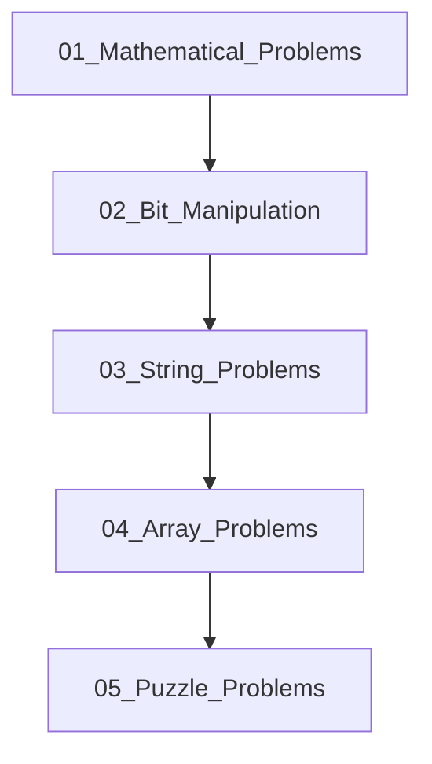

## Folder Map

| Type | Name | Purpose |
| --- | --- | --- |
| Folder | [01_Mathematical_Problems](01_Mathematical_Problems/README.md) | continue with the Mathematical Problems section |
| Folder | [02_Bit_Manipulation](02_Bit_Manipulation/README.md) | continue with the Bit Manipulation section |
| Folder | [03_String_Problems](03_String_Problems/README.md) | continue with the String Problems section |
| Folder | [04_Array_Problems](04_Array_Problems/README.md) | continue with the Array Problems section |
| Folder | [05_Puzzle_Problems](05_Puzzle_Problems/README.md) | continue with the Puzzle Problems section |

## Flowchart

# Problem Solving
This file mirrors the C++ repository structure for Python.

Content for this topic can be expanded here while keeping naming and traversal aligned across languages.
## Next Step

- Go to [README.md](01_Mathematical_Problems/README.md) to understand Mathematical Problems.
