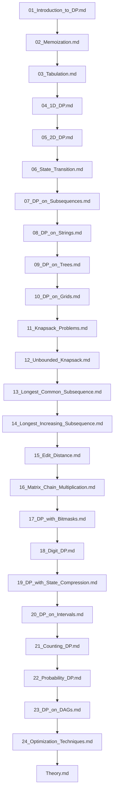

## Folder Map

| Type | Name | Purpose |
| --- | --- | --- |
| File | [01_Introduction_to_DP.md](01_Introduction_to_DP.md) | understand Introduction to DP |
| File | [02_Memoization.md](02_Memoization.md) | understand Memoization |
| File | [03_Tabulation.md](03_Tabulation.md) | understand Tabulation |
| File | [04_1D_DP.md](04_1D_DP.md) | understand 1D DP |
| File | [05_2D_DP.md](05_2D_DP.md) | understand 2D DP |
| File | [06_State_Transition.md](06_State_Transition.md) | understand State Transition |
| File | [07_DP_on_Subsequences.md](07_DP_on_Subsequences.md) | understand DP on Subsequences |
| File | [08_DP_on_Strings.md](08_DP_on_Strings.md) | understand DP on Strings |
| File | [09_DP_on_Trees.md](09_DP_on_Trees.md) | understand DP on Trees |
| File | [10_DP_on_Grids.md](10_DP_on_Grids.md) | understand DP on Grids |
| File | [11_Knapsack_Problems.md](11_Knapsack_Problems.md) | understand Knapsack Problems |
| File | [12_Unbounded_Knapsack.md](12_Unbounded_Knapsack.md) | understand Unbounded Knapsack |
| File | [13_Longest_Common_Subsequence.md](13_Longest_Common_Subsequence.md) | understand Longest Common Subsequence |
| File | [14_Longest_Increasing_Subsequence.md](14_Longest_Increasing_Subsequence.md) | understand Longest Increasing Subsequence |
| File | [15_Edit_Distance.md](15_Edit_Distance.md) | understand Edit Distance |
| File | [16_Matrix_Chain_Multiplication.md](16_Matrix_Chain_Multiplication.md) | understand Matrix Chain Multiplication |
| File | [17_DP_with_Bitmasks.md](17_DP_with_Bitmasks.md) | understand DP with Bitmasks |
| File | [18_Digit_DP.md](18_Digit_DP.md) | understand Digit DP |
| File | [19_DP_with_State_Compression.md](19_DP_with_State_Compression.md) | understand DP with State Compression |
| File | [20_DP_on_Intervals.md](20_DP_on_Intervals.md) | understand DP on Intervals |
| File | [21_Counting_DP.md](21_Counting_DP.md) | understand Counting DP |
| File | [22_Probability_DP.md](22_Probability_DP.md) | understand Probability DP |
| File | [23_DP_on_DAGs.md](23_DP_on_DAGs.md) | understand DP on DAGs |
| File | [24_Optimization_Techniques.md](24_Optimization_Techniques.md) | understand Optimization Techniques |
| File | [Theory.md](Theory.md) | understand Theory |

## Flowchart

# Dynamic Programming
This file mirrors the C++ repository structure for Python.

Content for this topic can be expanded here while keeping naming and traversal aligned across languages.
## Next Step

- Go to [01_Introduction_to_DP.md](01_Introduction_to_DP.md) to understand Introduction to DP.
