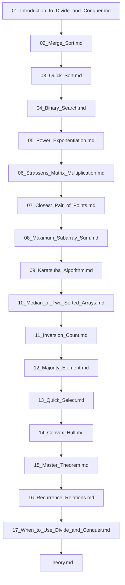

## Folder Map

| Type | Name | Purpose |
| --- | --- | --- |
| File | [01_Introduction_to_Divide_and_Conquer.md](01_Introduction_to_Divide_and_Conquer.md) | understand Introduction to Divide and Conquer |
| File | [02_Merge_Sort.md](02_Merge_Sort.md) | understand Merge Sort |
| File | [03_Quick_Sort.md](03_Quick_Sort.md) | understand Quick Sort |
| File | [04_Binary_Search.md](04_Binary_Search.md) | understand Binary Search |
| File | [05_Power_Exponentiation.md](05_Power_Exponentiation.md) | understand Power Exponentiation |
| File | [06_Strassens_Matrix_Multiplication.md](06_Strassens_Matrix_Multiplication.md) | understand Strassens Matrix Multiplication |
| File | [07_Closest_Pair_of_Points.md](07_Closest_Pair_of_Points.md) | understand Closest Pair of Points |
| File | [08_Maximum_Subarray_Sum.md](08_Maximum_Subarray_Sum.md) | understand Maximum Subarray Sum |
| File | [09_Karatsuba_Algorithm.md](09_Karatsuba_Algorithm.md) | understand Karatsuba Algorithm |
| File | [10_Median_of_Two_Sorted_Arrays.md](10_Median_of_Two_Sorted_Arrays.md) | understand Median of Two Sorted Arrays |
| File | [11_Inversion_Count.md](11_Inversion_Count.md) | understand Inversion Count |
| File | [12_Majority_Element.md](12_Majority_Element.md) | understand Majority Element |
| File | [13_Quick_Select.md](13_Quick_Select.md) | understand Quick Select |
| File | [14_Convex_Hull.md](14_Convex_Hull.md) | understand Convex Hull |
| File | [15_Master_Theorem.md](15_Master_Theorem.md) | understand Master Theorem |
| File | [16_Recurrence_Relations.md](16_Recurrence_Relations.md) | understand Recurrence Relations |
| File | [17_When_to_Use_Divide_and_Conquer.md](17_When_to_Use_Divide_and_Conquer.md) | understand When to Use Divide and Conquer |
| File | [Theory.md](Theory.md) | understand Theory |

## Flowchart

# Divide and Conquer
This file mirrors the C++ repository structure for Python.

Content for this topic can be expanded here while keeping naming and traversal aligned across languages.
## Next Step

- Go to [01_Introduction_to_Divide_and_Conquer.md](01_Introduction_to_Divide_and_Conquer.md) to understand Introduction to Divide and Conquer.
