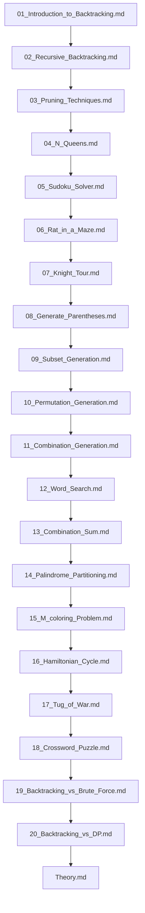

## Folder Map

| Type | Name | Purpose |
| --- | --- | --- |
| File | [01_Introduction_to_Backtracking.md](01_Introduction_to_Backtracking.md) | understand Introduction to Backtracking |
| File | [02_Recursive_Backtracking.md](02_Recursive_Backtracking.md) | understand Recursive Backtracking |
| File | [03_Pruning_Techniques.md](03_Pruning_Techniques.md) | understand Pruning Techniques |
| File | [04_N_Queens.md](04_N_Queens.md) | understand N Queens |
| File | [05_Sudoku_Solver.md](05_Sudoku_Solver.md) | understand Sudoku Solver |
| File | [06_Rat_in_a_Maze.md](06_Rat_in_a_Maze.md) | understand Rat in a Maze |
| File | [07_Knight_Tour.md](07_Knight_Tour.md) | understand Knight Tour |
| File | [08_Generate_Parentheses.md](08_Generate_Parentheses.md) | understand Generate Parentheses |
| File | [09_Subset_Generation.md](09_Subset_Generation.md) | understand Subset Generation |
| File | [10_Permutation_Generation.md](10_Permutation_Generation.md) | understand Permutation Generation |
| File | [11_Combination_Generation.md](11_Combination_Generation.md) | understand Combination Generation |
| File | [12_Word_Search.md](12_Word_Search.md) | understand Word Search |
| File | [13_Combination_Sum.md](13_Combination_Sum.md) | understand Combination Sum |
| File | [14_Palindrome_Partitioning.md](14_Palindrome_Partitioning.md) | understand Palindrome Partitioning |
| File | [15_M_coloring_Problem.md](15_M_coloring_Problem.md) | understand M coloring Problem |
| File | [16_Hamiltonian_Cycle.md](16_Hamiltonian_Cycle.md) | understand Hamiltonian Cycle |
| File | [17_Tug_of_War.md](17_Tug_of_War.md) | understand Tug of War |
| File | [18_Crossword_Puzzle.md](18_Crossword_Puzzle.md) | understand Crossword Puzzle |
| File | [19_Backtracking_vs_Brute_Force.md](19_Backtracking_vs_Brute_Force.md) | understand Backtracking vs Brute Force |
| File | [20_Backtracking_vs_DP.md](20_Backtracking_vs_DP.md) | understand Backtracking vs DP |
| File | [Theory.md](Theory.md) | understand Theory |

## Flowchart

# Backtracking
This file mirrors the C++ repository structure for Python.

Content for this topic can be expanded here while keeping naming and traversal aligned across languages.
## Next Step

- Go to [01_Introduction_to_Backtracking.md](01_Introduction_to_Backtracking.md) to understand Introduction to Backtracking.
