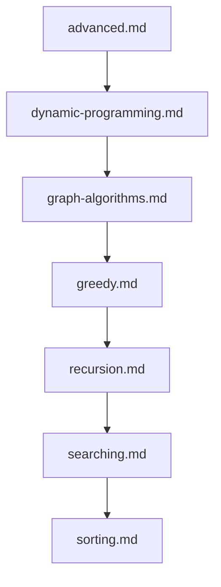

## Folder Map

| Type | Name | Purpose |
| --- | --- | --- |
| File | [advanced.md](advanced.md) | understand advanced |
| File | [dynamic-programming.md](dynamic-programming.md) | understand dynamic programming |
| File | [graph-algorithms.md](graph-algorithms.md) | understand graph algorithms |
| File | [greedy.md](greedy.md) | understand greedy |
| File | [recursion.md](recursion.md) | understand recursion |
| File | [searching.md](searching.md) | understand searching |
| File | [sorting.md](sorting.md) | understand sorting |

## Flowchart

# algorithms

This README is the navigation index for this folder.
## Next Step

- Go to [advanced.md](advanced.md) to understand advanced.
